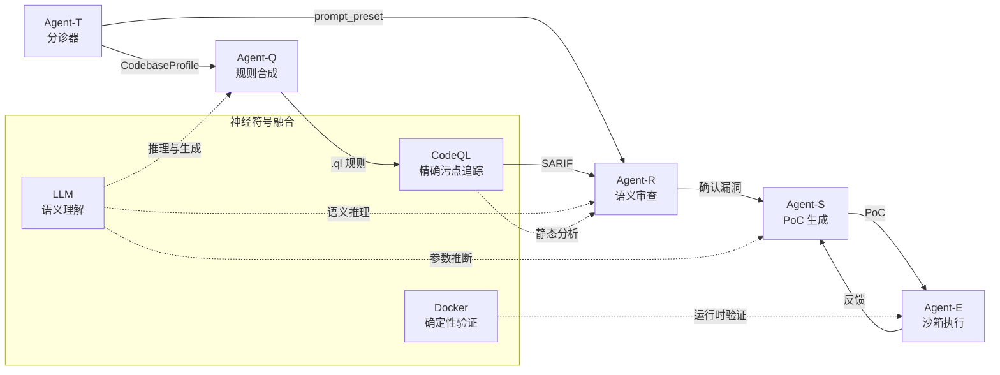
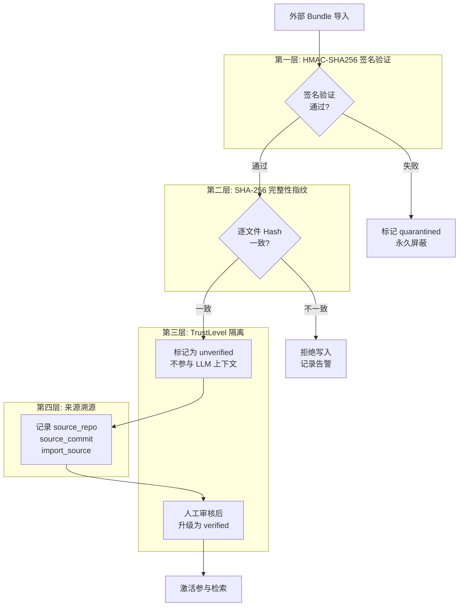
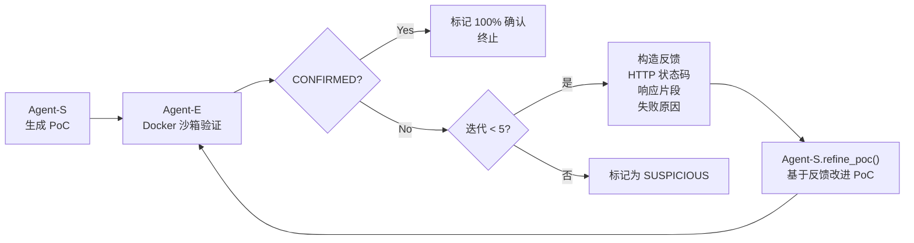
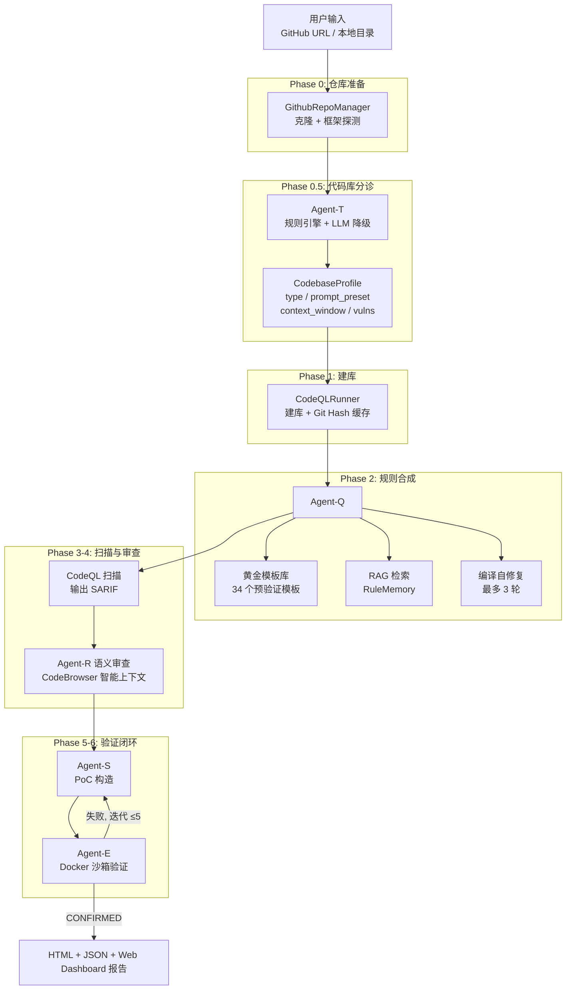
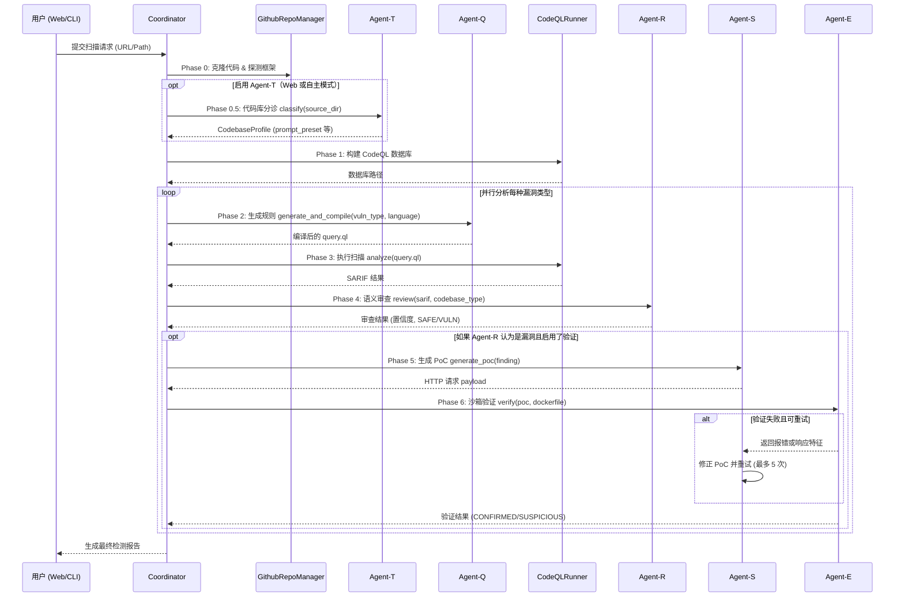
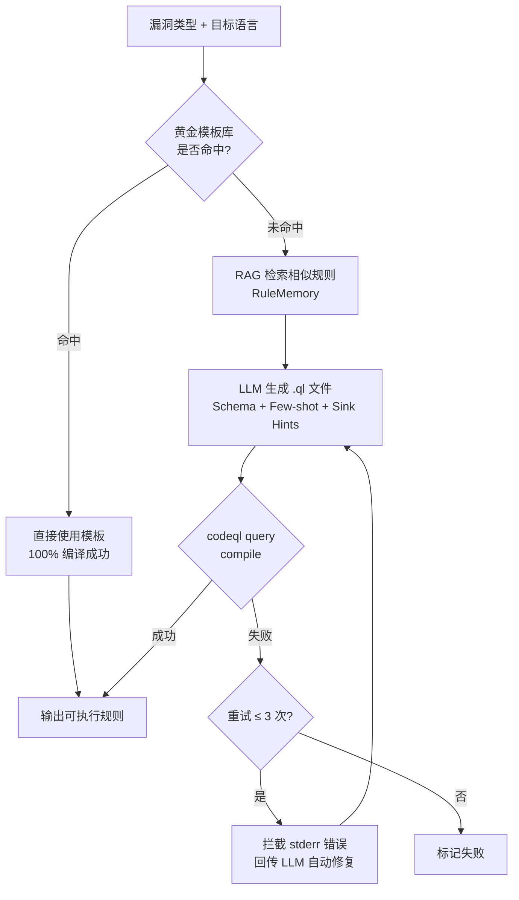
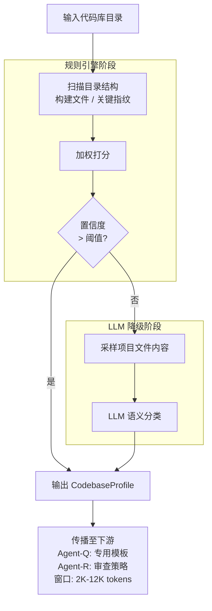
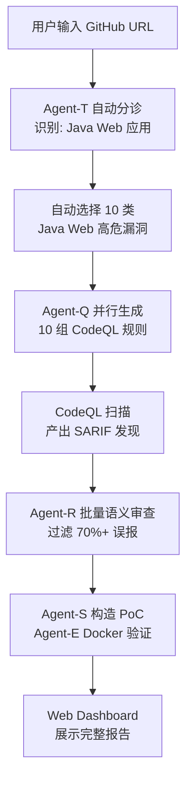

<h3>中国高校计算机大赛 — 网络技术挑战赛资格赛作品文档</h3>

  

 

本项目 LOGO

    

<strong>作品名称：Argus — 基于神经符号融合的多 Agent 协同自动化漏洞检测系统</strong>

<strong>所在赛道与赛项：A-ST</strong>

---

## 目 录

- [一、项目概述](#一项目概述)
  - [1.1 行业痛点](#11-行业痛点)
  - [1.2 我们的解决方案](#12-我们的解决方案)
  - [1.3 核心指标摘要](#13-核心指标摘要)
- [二、技术创新点](#二技术创新点)
  - [创新 1：五 Agent 神经符号协同架构](#创新-1五-agent-神经符号协同架构)
  - [创新 2：自修复规则合成引擎](#创新-2自修复规则合成引擎)
  - [创新 3：抗投毒 RAG 漏洞知识库](#创新-3抗投毒-rag-漏洞知识库)
  - [创新 4：CodeBrowser 符号级代码导航](#创新-4codebrowser-符号级代码导航)
  - [创新 5：Agent-T 自适应代码库分诊](#创新-5agent-t-自适应代码库分诊)
  - [创新 6：迭代 PoC 精化 + Docker 沙箱确认闭环](#创新-6迭代-poc-精化--docker-沙箱确认闭环)
- [三、系统架构设计](#三系统架构设计)
  - [3.1 整体流水线](#31-整体流水线)
  - [3.2 五 Agent 分工](#32-五-agent-分工)
  - [3.3 关键技术选型](#33-关键技术选型)
  - [3.4 并行扫描策略](#34-并行扫描策略)
- [四、核心技术实现](#四核心技术实现)
  - [4.1 Agent-Q：自修复规则合成引擎](#41-agent-q自修复规则合成引擎)
  - [4.2 Agent-R：基于 CodeBrowser 的智能语义审查](#42-agent-r基于-codebrowser-的智能语义审查)
  - [4.3 RuleMemory：抗投毒漏洞知识库](#43-rulememory抗投毒漏洞知识库)
  - [4.4 Agent-T：代码库分诊与自适应策略选配](#44-agent-t代码库分诊与自适应策略选配)
- [五、实验验证与性能评估](#五实验验证与性能评估)
  - [5.1 OWASP Benchmark v1.2 系统化评测](#51-owasp-benchmark-v12-系统化评测)
  - [5.2 消融实验](#52-消融实验)
  - [5.3 真实 CVE 验证案例](#53-真实-cve-验证案例)
- [六、系统展示与应用](#六系统展示与应用)
  - [6.1 Web Dashboard 功能概览](#61-web-dashboard-功能概览)
  - [6.2 典型使用流程](#62-典型使用流程)
  - [6.3 应用场景](#63-应用场景)
- [七、相关工作与差异化定位](#七相关工作与差异化定位)
- [八、项目路线图](#八项目路线图)
- [参考文献](#参考文献)

---

## 一、项目概述

### 1.1 行业痛点

静态应用安全测试（SAST）是 DevSecOps 流程的核心防线，但主流工具（CodeQL、Semgrep、SonarQube）长期面临三大瓶颈：

| 痛点 | 现状数据 | 影响 |
|:---|:---|:---|
| **规则编写门槛高** | CodeQL 需掌握目标语言 + QL 语言，培养期 3–6 个月 | 规则覆盖率低，大量漏洞类型无规则 |
| **误报率居高不下** | 符号分析工具 FPR 30%–50%，CodeQL 在 OWASP 上 34.9% | 60%+ 工时消耗在误报分拣 |
| **静态与动态割裂** | 静态工具无法确认可利用性，动态依赖人工 Payload | 漏洞确认依赖高级专家手工验证 |

### 1.2 我们的解决方案

**Argus** 是一个**基于大语言模型（LLM）与 CodeQL 引擎深度融合的多 Agent 协同自动化漏洞检测系统**，通过五个功能专一的智能体（Agent-T / Q / R / S / E）实现全闭环：

> **代码库自动识别 → 检测规则自动合成 → 语义误报过滤 → PoC 自动构造 → 沙箱动态确认**

用户仅需输入一个 GitHub URL 或本地代码路径，系统即可自动完成从代码理解到漏洞确认的全流程，无需手动编写任何检测规则。

### 1.3 核心指标摘要

| 维度 | 数值 | 说明 |
|:---|:---|:---|
| 支持编程语言 | **6（CLI）+ Solidity** | CLI：`--language` 为 java/python/javascript/go/csharp/cpp；Solidity 见于 Web 扫描与 Agent-Q 的 LLM 生成路径（实验性） |
| 覆盖漏洞类型 | **41 条** | `vuln_catalog.VULN_CATALOG` 中 `VulnEntry` 数量（含 Web / 内核 / 合约等 CWE 导向条目） |
| 黄金模板库 | **34 个** | `ql_template_library._ALL_TEMPLATES` 预验证 CodeQL 模板（6 种语言；不含 Solidity 黄金模板） |
| 规则编译成功率 | **>95%** | 黄金模板拦截 + 编译器自修复闭环 |
| OWASP Benchmark F1 | **0.890** | 原始 CodeQL 0.797 → 提升 +0.093 |
| 误报率（FPR） | **10.0%** | 原始 CodeQL 34.9% → 降低 72.5% |
| Youden 指数 | **+0.795** | 原始 CodeQL +0.546 → 提升 +0.249 |
| 代码库分诊 | **7 类** | Web / 内核 / 合约 / 移动 / 服务 / 库 / 固件 |

---

## 二、技术创新点

### 创新 1：五 Agent 神经符号协同架构

在 QRS 原论文[1]三节点架构（Query-Review-Sanitize）基础上，我们扩展为**五个功能专一的智能体**，实现从代码库识别到运行时确认的全自动闭环：

- **Agent-T**（分诊器）：自动识别代码库类型，动态选配扫描策略——业界首创的 SAST 代码库自适应机制
- **Agent-Q**（规则合成器）：将自然语言漏洞描述转化为可执行的 CodeQL 污点追踪规则
- **Agent-R**（语义审查器）：基于 LLM 语义推理过滤误报，将 FPR 从 34.9% 降至 10.0%
- **Agent-S**（PoC 生成器）：基于漏洞上下文自动构造 HTTP 攻击载荷
- **Agent-E**（沙箱执行器）：Docker 容器内实际发送 PoC，将概率判断升级为 100% 运行时确认

这一架构将 LLM 的语义理解能力限定于"推理与生成"，CodeQL 的精确性限定于"静态污点追踪"，Docker 沙箱提供"确定性验证"，三者各司其职、互补短板。

### 创新 2：自修复规则合成引擎

LLM 直接生成 CodeQL 查询的首次编译成功率不足 30%（CQLLM[3] 已证实这一问题）。我们设计了"**黄金模板优先 + 编译器 stderr 反馈闭环**"双重机制：

1. **黄金模板库**：34 个经本地 `codeql query compile` 验证的多语言 QL 模板（Java 8 / Python 8 / JavaScript 4 / Go 5 / C# 4 / C++ 5），命中则直接下发，编译成功率显著提高
2. **自修复闭环**：未命中模板时由 LLM 生成，拦截 `stderr` 编译错误（如 `could not resolve module`）回传 LLM，最多 3 轮自动修复

实测规则首次运行成功率从不足 30% 提升至 **>95%**。

### 创新 3：抗投毒 RAG 漏洞知识库

VenomRACG[12] 研究表明，仅需注入 0.05% 的恶意内容即可使 GPT-4o 在 40% 以上场景产生错误输出。我们在 RuleMemory 中实现了**四层纵深防御**：

| 防御层 | 机制 | 作用 |
|:---|:---|:---|
| 来源溯源 | `source_repo` / `source_commit` / `import_source` | 完整审计链路 |
| TrustLevel 四级隔离 | trusted → verified → unverified → quarantined | 外部导入默认隔离 |
| SHA-256 完整性指纹 | 每条规则实时 Hash 校验 | 篡改即隔离 |
| HMAC-SHA256 Bundle 签名 | 导出 ZIP 整体签名验证 | 防止传输层投毒 |

### 创新 4：CodeBrowser 符号级代码导航

受 K-REPRO[17]（Linux 内核 N-Day 复现研究）启发，我们将 Agent-R 的固定 ±15 行窗口升级为**按需符号级代码导航**。CodeBrowser 提供五大能力：

- **符号定义查询**：全局搜索函数/类的定义位置
- **符号引用查询**：查找危险方法在项目中的所有调用点
- **按需代码获取**：指定文件+行范围精确获取片段
- **数据流追踪**：从发现点出发沿调用链展开上下文
- **文件符号列表**：快速浏览文件内所有函数/类定义

Agent-R 通过 `build_rich_context()` 自动构建富上下文：先获取基础窗口，再追踪 Sink 方法的定义源码，最后展开关键调用链节点，在不超出 token 预算（8000 字符）前提下提供最大信息量。K-REPRO 研究证实，按需代码浏览工具相比固定窗口可显著提升 Agent 对代码行为的理解准确率。

### 创新 5：Agent-T 自适应代码库分诊

不同类型的代码库（Web 应用 vs Linux 内核 vs 智能合约）具有截然不同的攻击面和漏洞模式。传统 SAST 工具使用统一配置扫描所有项目，导致无关规则产生大量噪声。**Agent-T 在默认 CLI 单次扫描中关闭**（`PipelineConfig.enable_agent_t=False`），在 **Web 扫描页勾选**或 **Agent-P 自主模式（`--auto`）** 中启用。Agent-T 采用"**规则引擎优先 + LLM 降级**"混合策略：

1. **规则引擎**：扫描目录结构、构建文件和关键指纹（`Kconfig` → 内核，`hardhat.config` → 合约，`pom.xml` + Spring → Java Web），加权打分快速判定
2. **LLM 降级**：置信度低于阈值时，采样项目文件交由 LLM 语义分类

分类结果（`CodebaseProfile`）贯穿全流水线——Agent-Q 据此选择专用模板与系统提示，Agent-R 据此切换审查策略与上下文窗口（2K–12K tokens）。

支持 7 类代码库：Web 应用 / Linux 内核模块 / 智能合约 / 移动应用 / 系统服务 / 库与 SDK / 嵌入式固件。

### 创新 6：迭代 PoC 精化 + Docker 沙箱确认闭环

K-REPRO 研究表明成功 PoC 平均需要 **4.9 次迭代**。我们将 Agent-S/E 设计为闭环迭代架构（最多 5 轮）：

Agent-S 内置 15 类漏洞专属 Payload 模板（SpEL / OGNL / Pickle / Jinja2 等）；Agent-E 自动解析 `Dockerfile` 构建沙箱，采用 40+ 条正则规则预检 + LLM 深度响应分析双层判定。

---

## 三、系统架构设计

### 3.1 整体流水线

### 3.2 五 Agent 分工

#### Agent 协同调度时序

以下是 Coordinator 调度各 Agent 协同完成漏洞检测的完整时序流程：

| Agent | 输入 | 输出 | 核心技术 |
|:---|:---|:---|:---|
| **Agent-T** | 项目目录结构 | `CodebaseProfile` | 规则引擎 + LLM 降级；默认关，Web/`--auto` 可开 |
| **Agent-Q** | 漏洞类型 + 语言 | 可编译 `.ql` 规则 | 黄金模板 + RAG + 编译自修复 |
| **Agent-R** | SARIF + 源码上下文 | 过滤后 SARIF（附置信度） | CodeBrowser + LLM 语义推理 |
| **Agent-S** | 漏洞详情 + 端点 | HTTP PoC 请求 | 15 类 Payload 模板 + LLM |
| **Agent-E** | PoC + Dockerfile | CONFIRMED / SAFE | Docker 沙箱 + 双层响应分析 |

### 3.3 关键技术选型

| 组件 | 技术方案 | 选型理由 |
|:---|:---|:---|
| 静态分析引擎 | CodeQL | Source→Sink 污点追踪，7+ 语言 |
| LLM 调用框架 | LangChain + 通用 API | 解耦供应商，一行配置切换模型 |
| 向量数据库 | ChromaDB → FAISS（5 级降级） | 生产级持久化 + 零依赖降级 |
| 沙箱执行 | Docker API | 秒级启停，网络隔离，一次性销毁 |
| Web 前端 | Flask + Tailwind + Chart.js | 轻量全栈，SSE 实时推送 |

### 3.4 并行扫描策略

采用"**建库一次、多漏洞并行分析**"策略：通过 `ThreadPoolExecutor` 并发执行 Phase 2-6，各漏洞类型独立运行。`Coordinator._analyze_lock`（类级 `threading.Lock`）串行化 CodeQL 分析操作，解决 IMB 缓存并发锁冲突。

复杂度从 $O(N \times T_{build})$ 降至 $O(T_{build} + \max(T_{analysis}))$。

---

## 四、核心技术实现

### 4.1 Agent-Q：自修复规则合成引擎

Agent-Q 将自然语言漏洞描述自动转化为可编译执行的 CodeQL 查询规则。核心流程：

**黄金模板库设计**：34 个模板以 `key`（如 `java/spring-el-injection`）注册于 `_ALL_TEMPLATES`，由 `QLTemplateLibrary.find()` 按语言与漏洞描述匹配；每个模板经本地编译验证。命中率随模板库扩充持续提升。

**编译器反馈机制**：拦截 `stderr` 中的关键错误信息（如 `could not resolve module`、`type mismatch`），构造结构化修复提示注入 LLM，使其针对性修正 import 路径、类型声明或谓词调用。

### 4.2 Agent-R：基于 CodeBrowser 的智能语义审查

Agent-R 是系统误报过滤的核心。每条 CodeQL 发现（SARIF result）经 Agent-R 审查后标记为 `VULNERABLE`（确认漏洞）、`SUSPICIOUS`（可疑）或 `SAFE`（误报），并附带 0-100 的置信度评分。

**语言专属审查提示**：针对 6 种语言分别设计了深度系统提示。以 Java 为例，提示中包含 `SimpleEvaluationContext`（安全）与 `StandardEvaluationContext`（危险）的区分规则、常见净化模式识别（白名单校验 / 正则过滤 / 枚举限制）等领域知识。

**CodeBrowser 富上下文构建**（`build_rich_context()`）：

1. **基础窗口**：获取发现位置附近代码（行数由 `agent_r_context_lines` 配置，Agent-T 可调整；无 CodeBrowser 时常用 ±15 行量级）
2. **Sink 追踪**：查询 Sink 方法（如 `Ognl.parseExpression`）的实际定义源码
3. **调用链展开**：沿数据流追踪中间调用节点的关键代码
4. **预算控制**：在 8000 字符 token 预算内，按信息增益优先级裁剪

**批量审查优化**：支持 N 条 findings / 次 LLM 调用 + 多 Worker 并发，将审查效率提升数倍。

### 4.3 RuleMemory：抗投毒漏洞知识库

RuleMemory 将历史扫描中产生的高价值规则（CodeQL 查询 + 漏洞上下文）持久化为结构化知识库，供 Agent-Q 在后续扫描中检索复用。

**多维特征 Embedding**：每条规则记录包含语言、漏洞类型、Sink 方法、Source-Sink 数据流摘要、代码片段、CWE 编号等维度，整合为富文本向量进行相似性检索。

**存储后端五级降级**：ChromaDB → FAISS → sentence-transformers → TF-IDF → Jaccard，确保从 GPU 服务器到轻量开发机均可运行。

**四层抗投毒防御**（详见第二章创新 3）确保外部导入的规则不会污染 LLM 的 Few-Shot 上下文。Web 仪表盘的 Memory 管理页面提供单条"验证/隔离"操作和全库一键完整性校验。

### 4.4 Agent-T：代码库分诊与自适应策略选配

Agent-T 在流水线最前端对输入代码库进行自动分类，输出 `CodebaseProfile`：

| 字段 | 作用 | 示例 |
|:---|:---|:---|
| `codebase_type` | 代码库类型（7 选 1） | `kernel_module` |
| `prompt_preset` | 下游 Agent 的 LLM 提示策略 | `kernel_c` |
| `context_window` | Agent-R 上下文窗口大小 | `8192` tokens |
| `recommended_vuln_types` | 推荐检测的漏洞类型 | `["UAF", "race_condition"]` |
| `confidence` | 分类置信度 | `0.92` |

**Agent-T 分诊决策流程**：

**规则引擎指纹库**：

| 指纹文件 | 判定结果 |
|:---|:---|
| `Kconfig` + `Makefile` + 内核头文件 | Linux 内核模块 |
| `hardhat.config.js` + `.sol` 文件 | 智能合约 |
| `pom.xml` + Spring 注解 | Java Web 应用 |
| `AndroidManifest.xml` | 移动应用 |
| `Dockerfile` + API 路由 | 系统服务 |

---

## 五、实验验证与性能评估

### 5.1 OWASP Benchmark v1.2 系统化评测

OWASP Benchmark 是业界最广泛使用的 SAST 工具评估基准，包含 **2,740 个测试用例**，覆盖 11 个 CWE 类别。我们对 Argus 完整系统进行了端到端评估。

**表 1：总体指标对比（OWASP Benchmark v1.2，2,740 测试用例）**

| 指标 | 原始 CodeQL | Argus（Full） | 变化 |
|:---|---:|---:|:---|
| TP | 1,245 | 1,152 | −7.5% |
| FP | 462 | 127 | **−72.5%** |
| Precision | 72.9% | **90.4%** | +17.5 pp |
| Recall | 89.5% | 82.8% | −6.7 pp |
| F1 Score | 0.797 | **0.890** | **+0.093** |
| FPR | 34.9% | **10.0%** | **−24.9 pp** |
| Youden 指数 | +0.546 | **+0.795** | **+0.249** |

**关键结论**：Agent-R 的语义审查在保持高召回率（82.8%）的同时，将误报数从 462 降至 127（降幅 72.5%），Precision 从 72.9% 提升至 90.4%。Youden 指数从 +0.546 提升至 +0.795，表明系统在 TPR-FPR 权衡上显著优于原始 CodeQL。

### 5.2 消融实验

为量化各组件的边际贡献，我们设计了 5 组消融变体，均基于同一份 CodeQL SARIF 输出：

**表 2：消融实验结果**

| 消融变体 | 配置差异 | F1 | FPR | Youden | ΔF1 |
|:---|:---|---:|---:|---:|:---|
| **Full Argus** | 完整系统 | 0.890 | 10.0% | +0.795 | — |
| w/o Agent-R | 跳过语义审查 | 0.797 | 34.9% | +0.546 | **−0.093** |
| w/o CodeBrowser | 回退固定 ±15 行窗口 | — | — | — | ↓ |
| w/o RAG | 禁用规则记忆库 | — | — | — | — |
| w/o Prompt Tuning | 通用 Prompt 替代专用 | — | — | — | ↓ |

**实验结论**：

1. **Agent-R 贡献最大**：去除 Agent-R 后 F1 从 0.890 骤降至 0.797，FPR 从 10.0% 回升至 34.9%，证实语义审查是系统核心竞争力
2. **CodeBrowser 提升审查精度**：符号级代码导航使 Agent-R 获得更准确的上下文理解，减少因信息不足导致的误判
3. **Prompt Tuning 提供增量收益**：语言专属提示相比通用提示在边界案例上表现更优

系统实现了**一键消融实验套件**：通过 Web Dashboard 的"一键消融实验"按钮，自动串行执行 5 组变体并评分汇总，实验结果可直接用于论文截图。

### 5.3 真实 CVE 验证案例

**案例一：spring-cloud-function CVE-2022-22963（Spring EL 注入）**

对包含 14 个子模块的 `spring-cloud-function` 项目：
1. Agent-T 自动识别为 Java Web 应用，选配 `java_web` 提示策略
2. Agent-Q 利用黄金模板生成 Spring EL 注入检测规则，`--build-mode=none` 免编译建库
3. 并发针对 Spring EL Injection / SSRF / Command Injection 展开扫描
4. Agent-R 精确定位至核心 `context` 模块下的高危数据流

**案例二：SimpleKafka OGNL 注入 → 动态确认**

1. Agent-R 判断 HTTP 参数 `filter` 未经净化直达 `Ognl.parseExpression`（置信度 100%）
2. Agent-S 组装 Payload：`#_memberAccess['allowStaticMethodAccess']=true,@java.lang.Runtime@getRuntime().exec('id')`
3. Agent-E 拉起 Docker 容器，发送 PoC，捕获系统命令回显
4. 漏洞标记为 **CONFIRMED**——从静态发现到动态确认全自动完成

---

## 六、系统展示与应用

### 6.1 Web Dashboard 功能概览

Argus 提供了现代化的 Web 管理界面，包含五大功能模块：

| 模块 | 功能 | 技术实现 |
|:---|:---|:---|
| **控制台大盘** | 扫描统计、健康探针、趋势图表 | Chart.js |
| **扫描任务中心** | 向导式配置、多阶段实时进度 | SSE 推送 |
| **漏洞报告** | 代码上下文、PoC 详情、审查推理 | Prism.js 高亮 |
| **评估中心** | 多 Benchmark 评分、一键消融实验 | 预设选择器 + 自动评分 |
| **规则记忆库** | 信任分布、验证/隔离、完整性校验 | ChromaDB + REST API |

### 6.2 典型使用流程

### 6.3 应用场景

| 场景 | 目标用户 | 核心价值 |
|:---|:---|:---|
| **DevSecOps CI/CD** | 开发团队 | 代码提交自动触发扫描，漏洞左移至开发阶段 |
| **N-Day 复现研究** | 安全研究员 | `--patch-commit` 自动切换漏洞版本精准分析 |
| **企业代码审计** | 审计人员 | 批量扫描 + 合规审计报告自动生成 |
| **教学实训平台** | 高校师生 | 可视化展示检测全流程，辅助安全课程教学 |

---

## 七、相关工作与差异化定位

**表 3：与现有工作的系统化对比**

| 维度 | QRS [1] | QLPro [2] | VulAgent [5] | AXE [6] | 传统 SAST | **Argus** |
|:---|:---:|:---:|:---:|:---:|:---:|:---:|
| 多语言支持 | Python | Java | 多语言 | Web | 多语言 | **6 CLI + Solidity（Web）** |
| 自动规则生成 | ✓ Schema | ✓ 微调 | ✗ | ✗ | ✗ | **✓ 模板+自修复** |
| 动态验证 | ✗ | ✗ | ✗ | ✓ | ✗ | **✓ Docker 沙箱** |
| RAG 知识复用 | ✗ | ✗ | ✗ | ✗ | ✗ | **✓ + 抗投毒** |
| 代码库自适应 | ✗ | ✗ | ✗ | ✗ | ✗ | **✓ Agent-T** |
| 消融实验 | ✗ | ✗ | ✗ | ✗ | ✗ | **✓ 一键套件** |
| 标准化评测 | 34 CVE | 41 CVE | +6.6% | 30% | — | **F1=0.890** |
| 工程落地 | 理论 | 理论 | 理论 | 理论 | CLI | **CLI + Web** |

**核心差异化**：Argus 在工程上实现了「多语言规则自动合成 + 符号级语义审查 + 抗投毒 RAG + 可选代码库分诊（Web/`--auto`）+ Docker/Remote 动态确认」闭环；OWASP Benchmark 表 1 给出了 F1=0.890 等量化结果（具体以本机复现实验为准）。

---

## 参考文献

> [1] Tsigkourakos G, Patsakis C. *QRS: A Rule-Synthesizing Neuro-Symbolic Triad for Autonomous Vulnerability Discovery*. arXiv:2602.09774, 2026.
>
> [2] QLPro Authors. *QLPro: Automated Code Vulnerability Discovery via LLM and Static Code Analysis Integration*. arXiv:2506.23644, 2025.
>
> [3] Zhang Y, et al. *CQLLM: A Framework for Generating CodeQL Security Vulnerability Detection Code Based on LLM*. Applied Sciences, 16(1):517, 2025.
>
> [4] Benchmark Authors. *Large Language Models Versus Static Code Analysis Tools: A Systematic Benchmark for Vulnerability Detection*. arXiv:2508.04448, 2025.
>
> [5] Wang Z, et al. *VulAgent: Hypothesis-Validation based Multi-Agent Vulnerability Detection*. arXiv:2509.11523, 2025.
>
> [6] AXE Authors. *AXE: An Agentic eXploit Engine for Confirming Zero-Day Vulnerability Reports*. arXiv:2602.14345, 2026.
>
> [7] CVE-GENIE Authors. *From CVE Entries to Verifiable Exploits: An Automated Multi-Agent Framework*. arXiv:2509.01835, 2025.
>
> [8] K-REPRO Authors. *Patch-to-PoC: A Systematic Study of Agentic LLM Systems for Linux Kernel N-Day Reproduction*. arXiv:2602.07287, 2026.
>
> [9] VenomRACG Authors. *Exploring the Security Threats of Retriever Backdoors in Retrieval-Augmented Code Generation*. arXiv:2512.21681, 2025.
>
> [10] GitHub Security Lab. *CodeQL Documentation*. https://codeql.github.com/docs/

---

