

<h3>中国高校计算机大赛 — 网络技术挑战赛资格赛作品文档</h3>

  

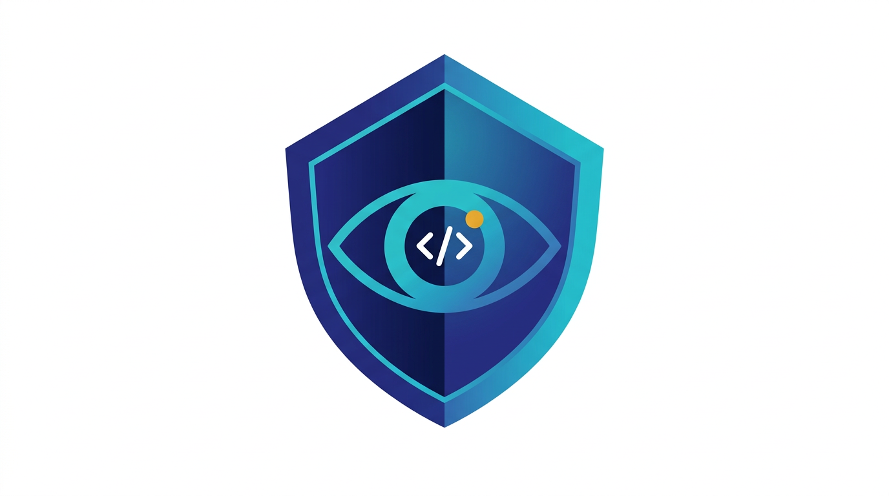

 

本项目 LOGO

    

<strong>作品名称：Argus — 基于神经符号融合的多 Agent 协同自动化漏洞检测系统</strong>

<strong>所在赛道与赛项：A-ST</strong>

# Argus：基于神经符号融合的多 Agent 协同自动化漏洞检测系统

**A Neuro-Symbolic Multi-Agent System for Automated Vulnerability Detection**

---

| 信息 | 内容 |
|:---|:---|
| **作品名称** | Argus — 多 Agent 协同自动化漏洞检测系统 |
| **参赛赛道** | A 类 · 安全技术赛道 |
| **参赛团队** | pigcoder-zeta |
| **文档版本** | 2026 年 4 月 |
| **开源地址** | <https://github.com/pigcoder-zeta/QRSE-X-CLI> |

## 目 录

- [摘要](#摘要)
- [一、项目背景与行业痛点](#一项目背景与行业痛点)
  - [1.1 传统 SAST 的困局：高误报与规则编写壁垒](#11-传统-sast-的困局高误报与规则编写壁垒)
  - [1.2 大模型辅助安全检测的瓶颈：幻觉、工程化与信任危机](#12-大模型辅助安全检测的瓶颈幻觉工程化与信任危机)
  - [1.3 新一代方案的核心诉求](#13-新一代方案的核心诉求)
- [二、Argus 系统概览与核心创新](#二argus-系统概览与核心创新)
  - [2.1 设计理念：让 LLM "受控地思考"，让 CodeQL "精确地执行"](#21-设计理念让-llm-受控地思考让-codeql-精确地执行)
  - [2.2 六大 Agent 协同闭环](#22-六大-agent-协同闭环)
  - [2.3 五大核心创新](#23-五大核心创新)
- [三、系统架构与核心模块解析](#三系统架构与核心模块解析)
  - [3.1 全链路流水线架构](#31-全链路流水线架构)
  - [3.2 智能分诊引擎（Agent-T）](#32-智能分诊引擎agent-t)
  - [3.3 自修复规则合成引擎（Agent-Q）](#33-自修复规则合成引擎agent-q)
  - [3.4 深度语义审查引擎（Agent-R）](#34-深度语义审查引擎agent-r)
  - [3.5 防投毒 RAG 漏洞知识库（RuleMemory）](#35-防投毒-rag-漏洞知识库rulememory)
  - [3.6 全链路动态验证引擎（Agent-S / Agent-E）](#36-全链路动态验证引擎agent-s--agent-e)
  - [3.7 补丁追踪与精准扫描机制](#37-补丁追踪与精准扫描机制)
  - [3.8 高并发调度引擎](#38-高并发调度引擎)
- [四、竞品对比与优势分析](#四竞品对比与优势分析)
  - [4.1 与工业级 SAST 工具对比](#41-与工业级-sast-工具对比)
  - [4.2 与学术界 LLM 辅助方案对比](#42-与学术界-llm-辅助方案对比)
  - [4.3 Argus 的差异化优势](#43-argus-的差异化优势)
- [五、实证测试与效能评估](#五实证测试与效能评估)
  - [5.1 评测基准：OWASP Benchmark v1.2](#51-评测基准owasp-benchmark-v12)
  - [5.2 核心指标对比](#52-核心指标对比)
  - [5.3 组件贡献度分析（消融实验）](#53-组件贡献度分析消融实验)
  - [5.4 真实项目验证](#54-真实项目验证)
  - [5.5 工程完成度量化](#55-工程完成度量化)
- [六、应用场景与落地前景](#六应用场景与落地前景)
  - [6.1 企业级 DevSecOps 流水线集成](#61-企业级-devsecops-流水线集成)
  - [6.2 大规模代码资产安全排查](#62-大规模代码资产安全排查)
  - [6.3 0day/Nday 自动化挖掘](#63-0daynday-自动化挖掘)
  - [6.4 安全合规与审计](#64-安全合规与审计)
  - [6.5 安全教育与攻防演练](#65-安全教育与攻防演练)
- [七、总结与展望](#七总结与展望)
- [参考文献](#参考文献)

## 摘要

> **一句话定位**：Argus 是业界首个将 LLM 语义推理、CodeQL 精确分析与 Docker 沙箱实证验证统一在自主多 Agent 闭环中的漏洞检测系统——用户仅需输入一个 GitHub URL，即可获得带完整证据链的漏洞报告。

静态应用安全测试（SAST）是企业代码安全防线的核心手段，却长期受困于两大矛盾。其一，以 CodeQL、Fortify 为代表的规则引擎误报率普遍在 30%–70% 之间，安全工程师的大量精力消耗在人工研判上。其二，编写一条高质量的污点追踪规则需同时掌握目标语言语义、框架数据流模式和 CodeQL Datalog 方言，规则维护对顶尖安全专家的依赖程度极高。近年兴起的大语言模型（LLM）辅助方案虽在语义理解上有所突破，但幻觉输出、工程鲁棒性不足、结果不可验证等问题使其难以进入生产环境。

本文提出 **Argus** 系统——一种基于神经符号融合的多 Agent 协同自动化漏洞检测架构。系统将 LLM 的语义推理严格限定在"策略生成与研判"层面，将精确的污点追踪与数据流分析交由 CodeQL 引擎执行，并通过 Docker 沙箱完成运行时验证，形成"**自主规划 → 智能生成 → 精确检测 → 语义研判 → 实证确认**"的全自动闭环。Argus 由六个功能专一的智能体（Agent-P / T / Q / R / S / E）协同驱动，其中 Agent-P 作为元决策层将系统从固定流水线提升为自主多 Agent 架构，原生覆盖 **7 种主流编程语言**、**22 类高危漏洞**与 **11 大安全检测领域**。核心创新如下：

1. **自主多 Agent 决策架构**：Agent-P 通过"侦察 → 规划 → 执行 → 评估"的自主循环，自动完成代码库特征分析与漏洞类型选择，实现零配置安全检测。
2. **动态自适应分诊**：智能分诊引擎自动识别 7 类代码库特征，按需配置扫描策略与 LLM 提示集，消除传统工具"一刀切"扫描带来的噪声。
3. **防投毒 RAG 漏洞知识库**：首创 TrustLevel 四级可信体系与 HMAC-SHA256 签名验证，系统性封堵知识库投毒攻击面，保证 LLM 上下文的纯净性。
4. **全链路沙箱验证**：自动化 PoC 生成（18 类 Payload 策略、71 个预置载荷）与迭代精化引擎配合 Docker 沙箱实时验证，将"静态猜测"转化为"动态实证"，解决 SAST 结果不可验证的长期痛点。
5. **自修复规则合成**：49 个预验证黄金模板（覆盖 7 语言 × 含反序列化 / XXE / Solidity 等全类型）+ 编译器反馈自修复闭环，规则首次运行成功率 >95%，消除 LLM 生成代码的编译不确定性。

在 OWASP Benchmark v1.2（2,740 测试用例，覆盖 11 个 CWE 类别）上，Argus 取得 **F1 = 0.890、精确率 90.4%、误报率 10.0%**，相较原始 CodeQL 引擎（F1 = 0.797、误报率 34.9%）实现精确率提升 **17.5 个百分点**、误报率下降 **72.5%**、Youden 指数提升 **0.249** 的全面突破。消融实验进一步验证了各组件的独立贡献与协同增益。

**关键词**：静态应用安全测试；大语言模型；CodeQL；多智能体系统；漏洞检测；神经符号融合；RAG；动态沙箱验证

## 一、项目背景与行业痛点

### 1.1 传统 SAST 的困局：高误报与规则编写壁垒

静态应用安全测试（SAST）作为 DevSecOps 的核心组件，已被全球超过 80% 的大型企业纳入 CI/CD 流水线。以 CodeQL、Semgrep、Fortify、Checkmarx 为代表的主流工具在实际部署中长期面临两大矛盾。

**矛盾一：误报率居高不下，安全运营成本失控。** 工业界实测数据表明，主流 SAST 工具的误报率普遍在 30%–70% 之间。以 CodeQL 为例，其在 OWASP Benchmark v1.2 上的原始误报率高达 34.9%。安全工程师需对每条告警逐行审查源码、追踪数据流并分析上下文，方能判定其真实性。在拥有数千万行代码资产的企业中，80% 的安全工时被消耗在误报过滤上，高危漏洞反而因"告警疲劳"被忽略。

**矛盾二：规则编写门槛极高，知识壁垒难以逾越。** 以一条检测 Spring Expression Language（SpEL）注入的 CodeQL 规则为例，编写者需同时掌握 Spring `ExpressionParser` 接口层次、`SimpleEvaluationContext` 与 `StandardEvaluationContext` 的安全差异、参数净化函数的识别逻辑以及 CodeQL Datalog 方言语法。培养一名胜任此类工作的安全工程师至少需要 2–3 年的专业训练。面对 7 种主流语言、22 类以上漏洞类型及持续演进的技术栈，即便是顶级安全团队也无法做到规则库的全面覆盖与及时更新。

### 1.2 大模型辅助安全检测的瓶颈：幻觉、工程化与信任危机

2024–2026 年间，大量研究将大语言模型（LLM）引入漏洞检测领域。学术界的系统性基准研究 [4] 表明，GPT-4.1、DeepSeek V3 等前沿模型在漏洞发现上的平均 F1 达 0.797，已超越多数传统 SAST 工具。但将 LLM 直接用于生产级检测仍面临三重瓶颈。

**瓶颈一：幻觉与编译失败。** 实测表明，LLM 直接生成的 CodeQL 规则首次编译通过率不足 30%，常见错误包括引用已废弃 API、错误的类型签名和不存在的模块路径。LLM 的生成过程本质上是概率性文本续写，无法保证语法和语义的正确性。

**瓶颈二：上下文理解偏差。** LLM 在审查代码时通常依赖固定窗口（如发现点前后各 15 行），无法主动追踪跨文件、跨模块的数据流。这导致已被净化的数据流被误判为漏洞，或经由复杂调用链传播的真实威胁被遗漏。2026 年 ICSE 研究进一步指出，LLM 在漏洞发现上的能力已趋于停滞，仅依靠传统代码度量的分类器即可达同等效果，说明 LLM 仍停留在浅层模式匹配阶段。

**瓶颈三：RAG 知识库信任危机。** 检索增强生成（RAG）是提升 LLM 安全专业性的主流手段，但安全领域的研究 [12] 已证明，仅需注入占语料库 0.05% 的恶意内容，即可使 GPT-4o 在超过 40% 的场景中产生错误输出。当前几乎所有 LLM 辅助安全工具均未建立 RAG 知识库的来源验证与完整性保护机制，知识库投毒可直接破坏系统的检测准确性。

### 1.3 新一代方案的核心诉求

以上分析可归纳为三条核心诉求：

| 诉求 | 传统 SAST 的不足 | 纯 LLM 方案的不足 |
|:---|:---|:---|
| **高检出、低误报** | 规则覆盖不全，误报率 >30% | 幻觉导致假阳性，结果不可信 |
| **全自动、零门槛** | 规则编写需顶尖专家 | 生成规则编译失败率 >70% |
| **可验证、可信任** | 仅输出静态告警，无法确认 | 无运行时验证，无知识库防护 |

下图对比了三类方案在上述诉求上的覆盖情况。Argus 是唯一实现全维度覆盖的方案：

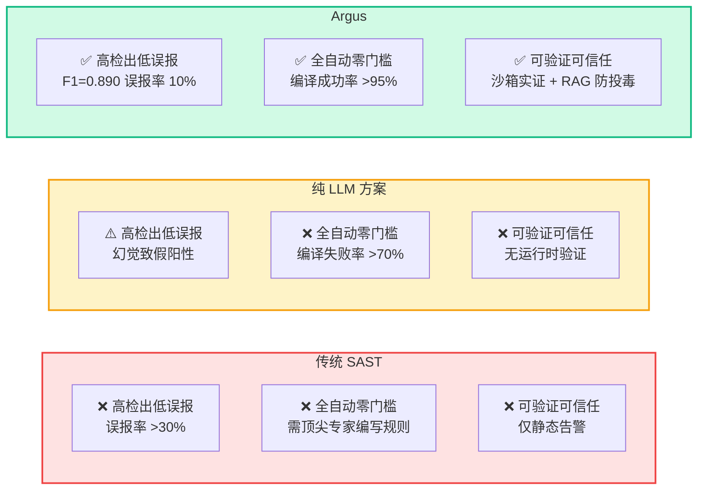

<strong>图 1</strong>　三类方案核心诉求覆盖对比

Argus 正是面向这三条诉求设计的。其核心思路是：不让 LLM 独立决策，而是将其严格限定在"策略生成"和"语义研判"两个环节；让 CodeQL 提供精确的静态分析能力，让 Docker 沙箱提供不可伪造的运行时验证；三者通过多 Agent 协同形成闭环——**用 LLM 的智能弥补 CodeQL 的死板，用 CodeQL 的精确约束 LLM 的幻觉，用沙箱的实证消除一切猜测。**

## 二、Argus 系统概览与核心创新

### 2.1 设计理念：让 LLM "受控地思考"，让 CodeQL "精确地执行"

传统的神经符号结合方案多采用"LLM 生成规则 + 直接执行"的二元架构，缺乏对 LLM 输出的质量控制与结果验证。Argus 突破这一局限，提出**"六阶段闭环、六 Agent 协同"**架构，核心约束如下：

- **LLM 不直接触碰代码分析**——其输出（CodeQL 查询、研判结论、PoC 脚本）必须经编译器验证、CodeQL 引擎执行或沙箱运行时确认，杜绝幻觉逃逸。
- **CodeQL 不需要人工编写规则**——由 LLM 在黄金模板和知识库约束下自动合成，编译自修复机制保证规则可用性。
- **每条漏洞发现都有证据链**——从静态检出到语义研判再到沙箱验证，形成完整的证据级输出。

### 2.2 六大 Agent 协同闭环

Argus 由六个功能专一的智能体组成，职责明确、接口标准化，通过流水线机制实现高效协作：

| Agent | 角色定位 | 核心能力 |
|:---|:---|:---|
| **Agent-P**（Planner） | 元决策层 | 自动侦察代码库特征（语言统计、框架检测、高风险依赖），智能规划扫描策略并动态评估结果质量，实现"侦察 → 规划 → 执行 → 评估"的自主决策循环 |
| **Agent-T**（Triage） | 智能分诊器 | 自动识别代码库类型（Web / 内核 / 合约等 7 类），按需配置扫描策略、LLM 提示集与上下文窗口 |
| **Agent-Q**（Query） | 规则合成器 | 黄金模板优先匹配 + LLM 生成 + 编译器反馈自修复闭环，覆盖 7 语言 × 22 漏洞类型 |
| **Agent-R**（Review） | 语义审查器 | 符号级代码导航 + 语言专属深度审查，精准过滤误报，输出结构化置信度评分 |
| **Agent-S**（Synthesize） | PoC 生成器 | 内置 18 类漏洞专属 Payload 策略，结合源码分析自动生成格式化 HTTP 验证请求 |
| **Agent-E**（Execute） | 沙箱执行器 | 自动化 Docker 环境部署 + PoC 发射 + 响应分析，输出不可伪造的验证结论 |

下图展示了六大 Agent 的协同关系与数据流向：

```mermaid
%%{init: {'themeVariables': {'fontSize': '18px', 'primaryTextColor': '#1e293b'}, 'flowchart': {'nodeSpacing': 55, 'rankSpacing': 60, 'padding': 18}}}%%
flowchart LR
    User(("👤 用户<br/>输入仓库 URL"))

    subgraph Meta ["元决策层"]
        P["🧠 Agent-P（Planner）<br/>侦察 · 规划 · 评估"]
    end

    subgraph Exec ["执行层（并行流水线）"]
        direction TB
        T["🔍 Agent-T（Triage）<br/>代码库分诊<br/>7 类自动识别"]
        Q["⚙️ Agent-Q（Query）<br/>规则合成<br/>49 黄金模板 + 自修复"]
        R["📋 Agent-R（Review）<br/>语义审查<br/>符号导航 + 深度研判"]
        S["💉 Agent-S（Synthesize）<br/>PoC 生成<br/>18 类 Payload 策略"]
        E["🐳 Agent-E（Execute）<br/>沙箱验证<br/>Docker 隔离执行"]
    end

    Report(("📊 报告输出<br/>HTML / JSON / SARIF<br/>Web Dashboard"))

    User -->|"仓库 URL"| P
    P -->|"ScanPlan<br/>漏洞类型 + 优先级"| T
    T -->|"CodebaseProfile<br/>类型 + 策略 + 窗口"| Q
    Q -->|".ql 规则<br/>编译验证通过"| R
    R -->|"SARIF + 研判结论<br/>置信度评分"| S
    S -->|"PoC HTTP 请求<br/>结构化载荷"| E
    E -->|"CONFIRMED ✅"| Report
    E -.->|"验证失败 → 反馈<br/>≤5 轮迭代精化"| S
    Report -.->|"EvaluationReport<br/>CONTINUE / RESCAN / STOP"| P

    style Meta fill:#ede9fe,stroke:#7c3aed,stroke-width:2px
    style Exec fill:#f0f9ff,stroke:#3b82f6,stroke-width:2px
    style P fill:#c4b5fd,stroke:#6d28d9,stroke-width:2px,color:#1e1b4b
    style T fill:#bfdbfe,stroke:#2563eb,stroke-width:1px
    style Q fill:#bfdbfe,stroke:#2563eb,stroke-width:1px
    style R fill:#bfdbfe,stroke:#2563eb,stroke-width:1px
    style S fill:#fde68a,stroke:#d97706,stroke-width:1px
    style E fill:#fde68a,stroke:#d97706,stroke-width:1px
```

<strong>图 2</strong>　六大 Agent 协同关系与数据流向

六大 Agent 形成**"自主规划 → 分诊 → 合成 → 检测 → 研判 → 实证"**的全自动闭环。在自主模式下，用户仅需输入一个 GitHub URL，Agent-P 即自动完成代码库侦察与漏洞类型规划，驱动下游 Agent 并行执行完整检测流水线，并在每轮扫描后评估结果质量、决定继续扫描或终止，最终输出带完整证据链的漏洞报告，全程无需人工介入。

### 2.3 五大核心创新

#### 创新一：自主多 Agent 决策架构

传统 SAST 和早期 LLM 辅助方案均要求用户手动指定扫描语言、漏洞类型和检测策略，面对多语言、多框架的复杂项目时配置成本极高。

Argus 引入 **Agent-P（Planner Agent）** 作为元决策层，实现**"侦察 → 规划 → 执行编排 → 评估"**的自主循环：

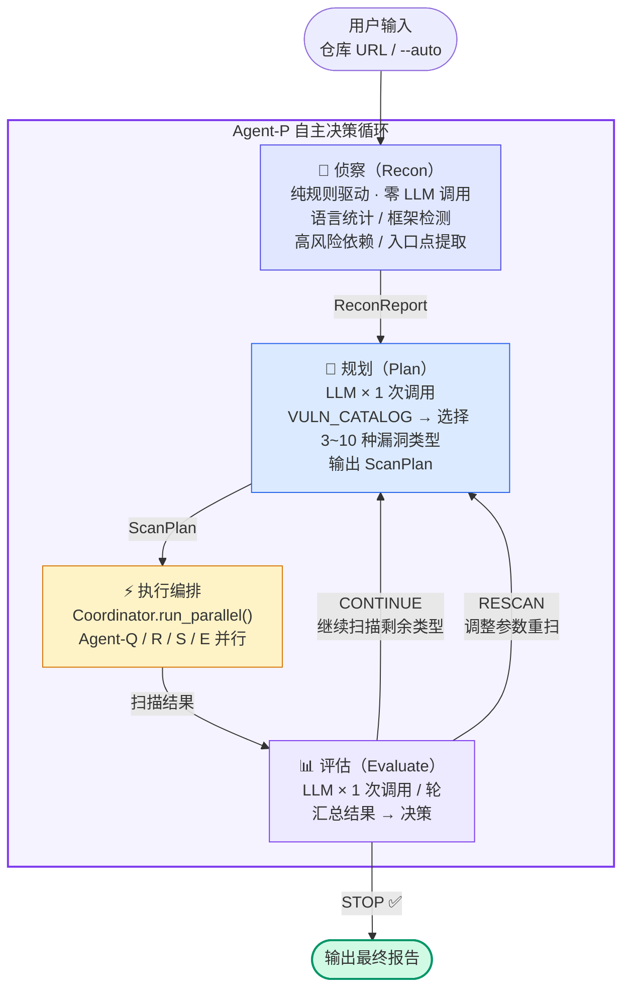

各阶段分工如下：

- **侦察阶段（Recon）**：纯规则驱动（零 LLM 调用），完成语言统计、框架检测、高风险依赖扫描和 HTTP 入口点提取，生成结构化 `ReconReport`。
- **规划阶段（Plan）**：基于侦察报告和内置 `VULN_CATALOG`，由 LLM 选择 3–10 种最相关的漏洞类型并排定优先级，生成 `ScanPlan`。
- **执行编排**：将扫描计划下发至 `Coordinator.run_parallel()`，驱动 Agent-Q / R / S / E 并行执行。
- **评估阶段（Evaluate）**：每轮扫描后汇总结果，由 LLM 决策 `CONTINUE`（继续扫描）/ `RESCAN`（调参重扫）/ `STOP`（终止），形成闭环自适应。

这一设计使 Argus 从固定流水线进化为自主多 Agent 系统——用户仅需输入仓库地址，系统自行完成全部决策与执行。

#### 创新二：动态自适应分诊

不同类型的代码库（Web 应用、内核模块、智能合约）具有截然不同的攻击面和漏洞模式。传统 SAST 工具使用统一规则集扫描所有项目，无关规则产生大量噪声。

Argus 的智能分诊引擎（Agent-T）采用**"规则引擎 + LLM 降级"的混合策略**，通过项目结构指纹、构建配置和代码特征自动识别 7 类代码库，输出包含扫描策略、LLM 提示集、推荐漏洞类型和上下文窗口配置的 `CodebaseProfile`，贯穿下游全部 Agent 的行为参数。由此，系统对每个项目的扫描均为量身定制——Web 项目聚焦注入漏洞，内核模块聚焦内存安全，智能合约聚焦重入与溢出。

#### 创新三：防投毒 RAG 漏洞知识库

Argus 构建了首个具备完整信任链保护的安全领域 RAG 系统。知识库以漏洞利用链路为 Embedding 单元（融合 Sink 方法、Source-Sink 数据流摘要、SARIF 消息及 CWE 分类），实现漏洞经验级别的语义检索。

在此基础上，系统构建了四层纵深防御：来源溯源审计链 → TrustLevel 四级可信隔离 → SHA-256 完整性指纹实时校验 → HMAC-SHA256 Bundle 签名验证。外部导入的知识条目默认处于隔离态，须通过来源白名单或人工审核方可激活，从根本上阻断知识库投毒对 LLM 上下文的污染。

#### 创新四：全链路沙箱验证

传统 SAST 仅输出静态告警，无法确认漏洞是否真实可利用。Argus 将检测链路延伸至运行时：Agent-S 基于 18 类 Payload 策略模板（涵盖 71 个预置载荷）和源码分析自动生成 PoC，Agent-E 解析项目的容器化配置构建沙箱并执行验证。

关键设计在于**迭代精化循环**——Agent-S 与 Agent-E 形成"生成 → 验证 → 反馈 → 改进"的闭环（最多 5 轮）。验证失败后的 HTTP 响应码、Body 片段、错误分析被完整反馈至 Agent-S，引导其从接口路径、参数名、Payload 编码等维度持续优化。漏洞复现领域的研究 [17] 表明，成功的漏洞验证平均需约 5 次迭代，该设计充分契合实际场景的复杂性。

#### 创新五：自修复规则合成

LLM 生成 CodeQL 查询的编译失败是该路线工业化的核心障碍。Argus 通过两级机制解决这一问题：

- **第一级：黄金模板库**——49 个经本地编译器实际验证的多语言规则模板（Java 12 个、Python 10 个、JavaScript 6 个、Go 5 个、C# 6 个、C/C++ 7 个、Solidity 3 个），精确匹配时直接下发，100% 编译成功。
- **第二级：编译器反馈自修复**——未匹配模板时由 LLM 生成规则；编译失败后自动截取错误信息回传 LLM 进行定向修复，最多 3 轮迭代，将规则首次运行成功率从不足 30% 提升至 95% 以上。

## 三、系统架构与核心模块解析

### 3.1 全链路流水线架构

Argus 采用**六阶段流水线架构**，各阶段产物标准化传递，支持灵活的并行与串行编排：

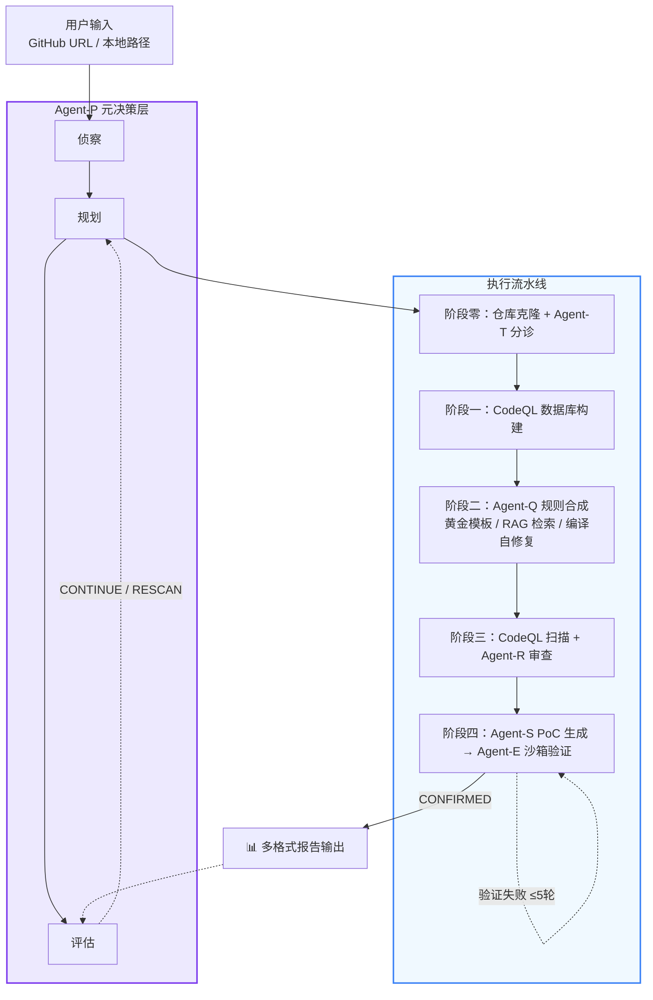

<strong>全链路六阶段流水线架构</strong>

流水线具备以下设计特点：

| 特性 | 说明 |
|:---|:---|
| 增量缓存 | 基于 Git Commit Hash 的数据库缓存，相同版本代码重复扫描时跳过构建阶段 |
| 自适应构建 | 自动探测 Maven / Gradle / 包管理器，为 CodeQL 选择最优构建策略 |
| 阶段解耦 | 各阶段通过标准化接口（SARIF / JSON / CodebaseProfile）衔接，支持独立调试与替换 |
| 灵活编排 | 支持跳过语义审查（快速扫描模式）或跳过沙箱验证（纯静态模式）等多种配置 |

#### 全域安全检测矩阵

Argus 的检测能力并非局限于 Web 注入漏洞，而是覆盖 **11 大安全领域**的全域矩阵，通过统一的 Agent 流水线实现异构安全问题的一体化检测：

| 安全领域 | 典型问题 | 技术方案 | 接入方式 |
|:---|:---|:---|:---|
| 注入漏洞 | SQL / 命令 / 表达式注入、SSRF、XSS、路径穿越 | CodeQL 污点追踪 | 原生 |
| 密码学缺陷 | 弱加密算法、硬编码凭证、不安全随机数、不安全 TLS | CodeQL 模式匹配 | 原生 |
| 内存安全（C/C++） | 缓冲区溢出、整数溢出 → malloc、不安全字符串函数 | CodeQL 模式匹配 + 本地数据流 | 原生 |
| 资源管理 | 文件 / 连接 / Socket 未关闭、内存泄露 | CodeQL 模式匹配 | 原生 |
| 并发安全 | 竞态条件（TOCTOU）、不安全的共享状态 | CodeQL 模式匹配 | 原生 |
| 信息泄露 | 堆栈跟踪泄露、敏感数据暴露 | CodeQL 污点追踪 | 原生 |
| IaC 配置安全 | Terraform / K8s / Docker 错误配置 | 外部 SARIF 接入（`--external-sarif`） | 扩展 |
| 移动安全（Android） | Intent 劫持、明文存储、WebView RCE、ContentProvider 泄露 | CodeQL Java + Android 专用查询 | 原生 |
| 供应链安全（SCA） | 已知 CVE 依赖、Typosquatting 恶意包 | 包元数据解析 + OSV.dev API（`--sca`） | 扩展 |
| 智能合约（Solidity） | 重入攻击、未检查返回值、整数溢出、`tx.origin` | CodeQL 实验性 Solidity 支持 | 原生 |
| 二进制 / 固件 | 危险函数导入、缓冲区溢出、固件提取分析 | Binwalk + Ghidra/Radare2 → SARIF（`--firmware`） | 扩展 |

这一矩阵使 Argus 不再是一个"Web 漏洞扫描器"，而是一个**覆盖应用层、系统层、供应链层与物联网层的全栈安全分析平台**。"原生"接入表示通过内置 Agent 流水线直接支持；"扩展"接入表示通过标准化接口（外部 SARIF / SCA API / 二进制适配器）集成第三方工具，Agent-R 对所有来源的告警统一进行语义审查。

### 3.2 智能分诊引擎（Agent-T）

**所解决的问题**：传统 SAST 对所有项目采用统一配置，内核项目被检测 XSS、Web 项目被检测缓冲区溢出，产生大量无效告警。

**架构设计**：采用"规则引擎优先 + LLM 降级"的混合分类策略。

- **规则引擎阶段**：扫描项目目录结构、构建配置文件和关键代码指纹（如 `Kconfig` → 内核模块，`hardhat.config` → 智能合约，Spring 注解 → Java Web），通过加权评分快速判定代码库类型。该阶段不消耗 LLM 调用，零成本完成绝大多数项目的分类。
- **LLM 降级阶段**：当规则引擎置信度低于阈值时，采样项目文件交由 LLM 进行语义级分类，覆盖非标准结构的长尾场景。

**分诊输出（CodebaseProfile）**：

| 字段 | 含义 | 示例值 |
|:---|:---|:---|
| `codebase_type` | 代码库类型（7 类） | `kernel_module` |
| `prompt_preset` | LLM 提示策略标识 | `kernel_c` |
| `context_window` | Agent-R 上下文窗口大小 | `8192` tokens |
| `recommended_vuln_types` | 推荐检测的漏洞类型集合 | `["UAF", "race_condition"]` |
| `confidence` | 分类置信度 | `0.92` |

**下游传播机制**：`CodebaseProfile` 贯穿全流水线——Agent-Q 据此选择对应语言的规则模板与系统提示，Agent-R 据此切换审查策略（如内核模式侧重 UAF、竞态条件分析）并调整上下文窗口大小。

**支持的 7 类代码库**：

| 类型 | 典型特征 | 推荐漏洞检测方向 |
|:---|:---|:---|
| Web 应用 | Spring / Django / Express 等框架 | 注入漏洞、XSS、SSRF |
| Linux 内核模块 | Kconfig / Makefile / 内核头文件 | UAF、竞态条件、整数溢出 |
| 智能合约 | Solidity / Hardhat / Truffle | 重入攻击、整数溢出 |
| 移动应用 | AndroidManifest / Gradle Android | Intent 劫持、WebView RCE |
| 系统服务 | Systemd / 守护进程模式 | 权限提升、资源泄露 |
| 库 / SDK | 包管理配置 / API 导出模式 | 供应链安全、接口滥用 |
| 嵌入式固件 | 交叉编译工具链 / BSP 结构 | 缓冲区溢出、硬编码凭证 |

### 3.3 自修复规则合成引擎（Agent-Q）

**所解决的问题**：LLM 直接生成 CodeQL 查询的编译成功率不足 30%，是 LLM + SAST 路线工业化落地的核心障碍。

**核心机制**采用"模板优先 → 约束生成 → 编译自修复"的三级决策路径，如下图所示：

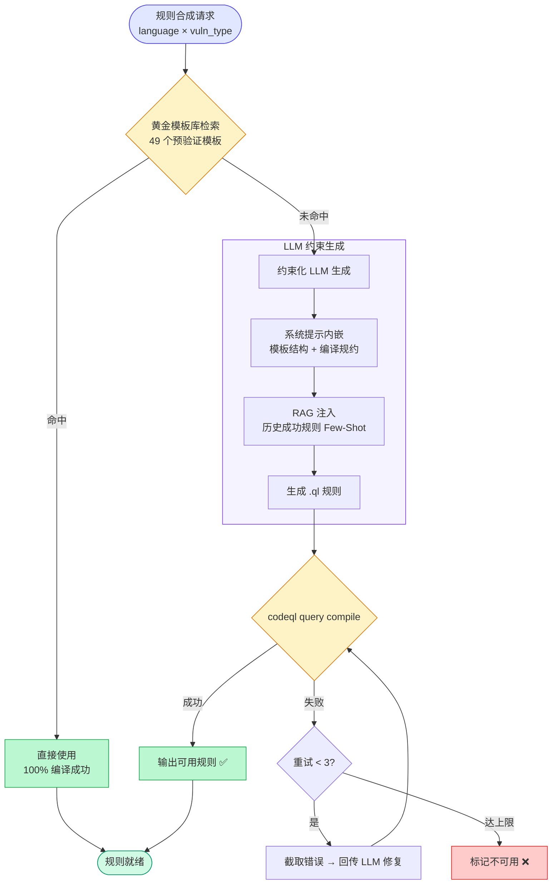

<strong>图 3</strong>　自修复规则合成三级决策路径

**黄金模板库规模**：

| 语言 | 模板数量 | 覆盖漏洞类型 |
|:---|:---:|:---|
| Java | 12 | SpEL / OGNL / MVEL / EL 综合 / SQL / Command / Path Traversal / SSRF / XSS / 反序列化 / XXE / LDAP 注入 |
| Python | 10 | Jinja2 / Mako / SSTI 综合 / SQL / Command / Path Traversal / XSS / SSRF / 反序列化 / LDAP 注入 |
| JavaScript | 6 | SQL / Command / Path Traversal / SSRF / XSS / 原型链污染 |
| Go | 5 | SQL / Command / Path Traversal / SSRF / XSS |
| C# | 6 | SQL / Command / Path Traversal / SSRF / XSS / 反序列化 |
| C/C++ | 7 | Command / Path Traversal / SQL / Buffer Overflow / SSRF / 格式化字符串 / UAF |
| Solidity | 3 | 重入攻击 / 未检查返回值 / tx.origin 滥用 |
| **合计** | **49** | 覆盖注入、模板引擎、路径穿越、SSRF、XSS、反序列化、XXE、内存安全、智能合约九大类 |

黄金模板库的价值不仅在于保证高频漏洞类型的即时可用性，更在于为 LLM 生成路径提供高质量的结构参考——系统提示中嵌入的模板结构相当于向 LLM 展示"一条正确的 CodeQL 规则应有的形态"，显著降低幻觉生成的概率。

### 3.4 深度语义审查引擎（Agent-R）

**所解决的问题**：CodeQL 污点追踪存在固有的过度近似（over-approximation），产生大量不可利用的虚假路径告警，传统方案依赖人工逐条审查。

**核心机制**：Agent-R 对 CodeQL 输出的每条 SARIF 告警进行深度语义审查，结合源码上下文和数据流信息，输出结构化的可利用性研判结论。

#### 符号级代码导航引擎（CodeBrowser）

Agent-R 的关键差异化能力在于**符号级代码导航引擎**，彻底替代固定行窗口的朴素上下文获取方式。该引擎提供五项导航能力：

| 能力 | 说明 |
|:---|:---|
| 符号定义查询 | 全局搜索函数/类的定义位置，追踪危险 Sink 的实际实现 |
| 符号引用查询 | 查找危险方法在项目中的所有调用点，评估攻击面广度 |
| 按需代码获取 | 指定文件 + 行范围精确获取代码片段 |
| 数据流追踪 | 从发现点沿调用链展开上下文 |
| 文件符号索引 | 快速浏览文件内所有函数/类定义 |

Agent-R 的**富上下文构建策略**如下图所示：

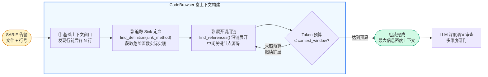

<strong>图 4</strong>　Agent-R 富上下文构建策略

构建流程为：先获取基础上下文窗口，再追踪 Sink 方法的定义源码，最后展开中间调用链的关键节点，在不超出 token 预算前提下为 LLM 提供最大信息密度的上下文。

#### 语言专属审查策略

系统为每种目标语言设计了深度定制的审查提示，涵盖该语言生态的特有安全模式。以 Java 为例：

| 审查维度 | 分析要点 |
|:---|:---|
| 执行上下文 | 区分安全的 `SimpleEvaluationContext` 与危险的 `StandardEvaluationContext` |
| 净化器识别 | 识别正则白名单过滤、黑名单关键词过滤、编码转义等净化模式 |
| 数据流完整性 | 追踪用户输入是否被完整求值，还是仅作字面量安全拼接 |
| 权限控制 | 评估接口访问控制级别对漏洞风险等级的影响 |

**输出规范**：每条审查结论包含状态标签（`vulnerable / safe / uncertain`）、量化置信度评分、检测引擎标识、推理说明和 Sink 方法签名，形成标准化研判记录。

### 3.5 防投毒 RAG 漏洞知识库（RuleMemory）

**所解决的问题**：LLM 安全专业性依赖外部知识增强，但 RAG 知识库面临投毒风险。研究 [12] 表明，仅需注入 0.05% 的恶意内容即可使 GPT-4o 在 40% 以上场景中产生错误输出。

#### 知识表示与检索

RuleMemory 以**漏洞利用链路**为 Embedding 单元，融合多维特征进行语义编码：

| 特征维度 | 内容 |
|:---|:---|
| 语言标识 | 目标编程语言 |
| 漏洞分类 | CWE 编号 + 漏洞类型 |
| Sink 方法 | 危险函数签名 |
| 数据流摘要 | Source → Sink 的关键传播路径 |
| SARIF 消息 | CodeQL 原始告警信息 |
| 规则代码 | 已验证的 QL 查询语句 |

存储后端支持五级降级策略（ChromaDB → FAISS → sentence-transformers → TF-IDF → Jaccard），保证在不同部署环境下的可用性。

#### 四层纵深防御体系

下图展示了 RuleMemory 的四层纵深防御架构，从外部数据入口到 LLM 上下文注入形成层层过滤的信任漏斗：

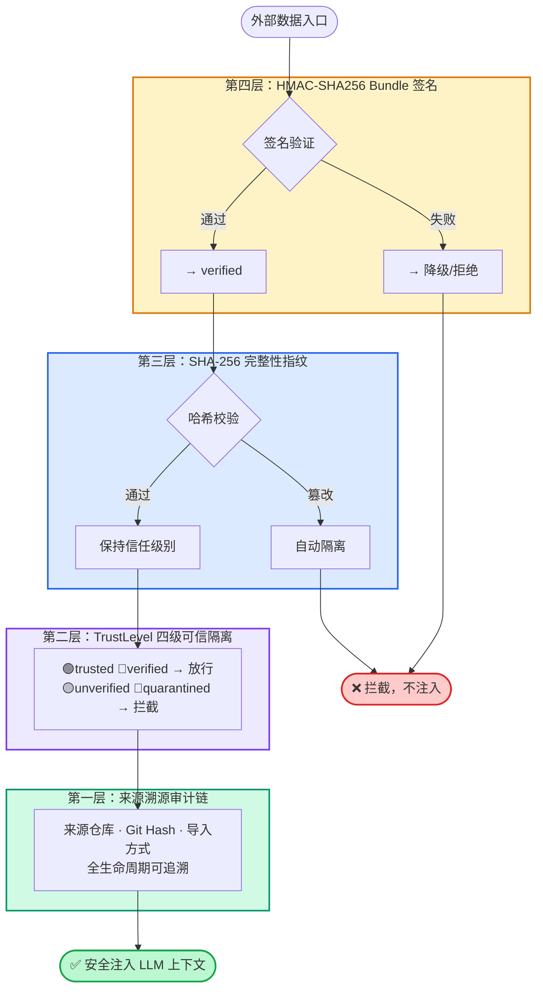

<strong>图 5</strong>　RuleMemory 四层纵深防御架构

**第一层：来源溯源（Provenance Tracking）**

每条知识记录携带完整审计信息——来源仓库地址、Git Commit Hash 和导入方式（本地扫描 / Bundle 导入 / 手动添加），实现全生命周期可追溯。

**第二层：TrustLevel 四级可信隔离**

| 信任级别 | 产生场景 | 是否参与检索 |
|:---|:---|:---:|
| `trusted` | 团队成员手动验证 | ✅ |
| `verified` | 本机本地扫描生成（默认） | ✅ |
| `unverified` | 外部 Bundle 导入，未经审核 | ❌ |
| `quarantined` | 标记可疑或篡改触发 | ❌ |

检索接口默认仅注入 `verified` 及以上级别的记录进入 LLM 上下文，外部导入条目须经人工审核后方可激活。

**第三层：SHA-256 完整性指纹**

每条记录在存储时计算对应规则文件的 SHA-256 哈希并持久化。检索时对每个候选记录实时校验：若文件内容被篡改，自动隔离该记录并记录安全告警，同时从检索结果中剔除。支持全库批量离线校验。

**第四层：HMAC-SHA256 Bundle 签名**

知识库导出为 Bundle 时，系统为每个规则文件生成 SHA-256 清单，并对整体清单计算 HMAC-SHA256 签名。导入时执行签名验证：通过则标记为 `verified`；签名缺失或不匹配则全批次降级为 `unverified`；单文件哈希不符则拒绝写入。系统支持配置受信任来源白名单，匹配白名单的 Bundle 来源自动升级信任级别。

### 3.6 全链路动态验证引擎（Agent-S / Agent-E）

**所解决的问题**：传统 SAST 仅输出"可能存在漏洞"的静态告警，安全团队无法判断漏洞是否可利用，修复优先级决策困难。

#### Agent-S：智能 PoC 生成器

Agent-S 内置 18 类漏洞专属 Payload 策略模板，覆盖主流 Web 漏洞利用场景：

| 漏洞引擎 | Payload 策略 | 载荷数 |
|:---|:---|:---:|
| Spring SpEL | `T(java.lang.Runtime).getRuntime().exec(...)` 等 RCE 原语 | 4 |
| OGNL | `@java.lang.Runtime@getRuntime().exec(...)` + 静态方法访问绕过 | 3 |
| MVEL | `Runtime.getRuntime().exec(...)` + Scanner 回显链 | 2 |
| Jinja2 | `__class__.__mro__` 沙箱逃逸 → 命令执行链 | 3 |
| Mako | `${__import__('os').popen(...)}` 直接执行 | 2 |
| SQL 注入 | 联合查询 / 布尔盲注 / 时间盲注 / `xp_cmdshell` 提权 | 9 |
| 命令注入 | 管道符 / 反引号 / `$()` / 换行符 / `curl` 外带 | 12 |
| 路径穿越 | `../` 遍历 / URL 编码绕过 / `%00` 截断 / 双写绕过 | 8 |
| SSRF | 云元数据 / 内网探测 / `file://` / `gopher://` / `dict://` 多协议 | 10 |
| XSS | `<script>` / `onerror` / `javascript:` / SVG / Cookie 外带 | 7 |
| 反序列化 | Java ysoserial gadget chain + Python pickle `__reduce__` | 4 |
| 不安全重定向 | `//` 双斜杠 / URL 编码 / `@` 混淆等绕过手法 | 4 |
| 日志注入 | CRLF 伪造 + Log4Shell `${jndi:ldap://...}` | 3 |
| **合计** | **18 类策略** | **71** |

Agent-S 结合 LLM 对源码的参数推断能力（接口路径、参数名、Content-Type 等），将策略模板实例化为完整的 HTTP 验证请求。

#### Agent-E：自动化沙箱执行器

Agent-E 自动解析目标项目中的 `Dockerfile` / `docker-compose.yml`，动态构建镜像并拉起隔离沙箱。新增 Docker 镜像复用缓存（_image_cache）——相同仓库路径的后续验证直接复用已构建镜像，避免重复 docker build 开销。HTTP 请求构造能力已全面扩展：支持 JSON Body（pplication/json）、自定义 Header 与 Cookie 的完整构造，覆盖现代 API 的真实调用场景。验证判定采用**双层分析机制**：

| 判定层 | 方法 | 说明 |
|:---|:---|:---|
| 第一层 | 规则预检引擎 | 16 类、40+ 条正则规则快速匹配已知漏洞利用特征 |
| 第二层 | LLM 深度响应分析 | 对复杂响应模式进行语义级判定 |

验证通过的漏洞标记为 `CONFIRMED`——这是具有运行时实证支持的最高确信级别。

#### 迭代精化循环

Agent-S 与 Agent-E 形成**"生成 → 验证 → 反馈 → 改进"的闭环**（最多 5 轮迭代）：

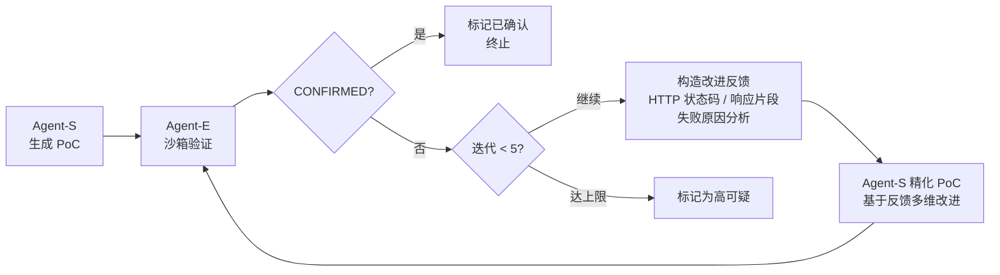

<strong>图 6</strong>　Agent-S / Agent-E 迭代精化循环

精化过程从五个维度引导 LLM 改进 PoC：接口路径推断、参数名校正、Payload 编码调整、Content-Type 匹配和前置请求补充。

### 3.7 补丁追踪与精准扫描机制

**所解决的问题**：CVE 漏洞分析通常需要研究人员手动定位漏洞版本、提取关键变更函数并构建测试环境，流程耗时且易出错。

Argus 内置补丁感知扫描模式（Patch-Aware），支持"给定修复 commit，自动聚焦漏洞版本"的精准分析：

| 阶段 | 标准扫描模式 | 补丁追踪模式 |
|:---|:---|:---|
| 仓库准备 | 克隆最新版本 | 自动回溯至修复 commit 的父版本（漏洞版本） |
| 变更分析 | — | 解析 Diff 提取被修改函数列表 |
| 规则合成 | 通用 Sink 提示 | 被修改函数作为热区注入规则合成的 Sink Hints |
| 审查聚焦 | 全量上下文 | 符号导航引擎优先追踪热区调用链 |

该模式将人工 CVE 分析流程中"定位版本 → 提取变更 → 构建环境"的典型 2–4 小时操作压缩至全自动执行，适用于 Nday 漏洞批量验证与安全补丁完整性审查。

### 3.8 高并发调度引擎

**所解决的问题**：大型项目通常需同时检测多种漏洞类型，串行扫描导致耗时线性增长。

Argus 的调度中心采用**"串行建库 + 并行分析"**架构：

```mermaid
gantt
    title 高并发调度模型（5 种漏洞类型示例）
    dateFormat X
    axisFormat %s

    section 串行阶段
    Phase 0 克隆仓库 + 分诊            :done, p0, 0, 4
    Phase 1 CodeQL 数据库构建（一次性）  :done, p1, 4, 120

    section 并行流水线 1
    SQL 注入 — Agent-Q 规则合成         :active, sq1, 120, 128
    SQL 注入 — CodeQL 扫描 🔒          :sq2, 128, 158
    SQL 注入 — Agent-R 审查            :sq3, 158, 183

    section 并行流水线 2
    命令注入 — Agent-Q                 :active, ci1, 120, 130
    命令注入 — CodeQL 扫描 🔒          :ci2, 158, 186
    命令注入 — Agent-R                 :ci3, 186, 211

    section 并行流水线 3
    SSRF — Agent-Q                    :active, ss1, 120, 126
    SSRF — CodeQL 扫描 🔒             :ss2, 186, 214
    SSRF — Agent-R                    :ss3, 214, 239

    section 并行流水线 4
    XSS — Agent-Q                     :active, xs1, 120, 129
    XSS — CodeQL 扫描 🔒              :xs2, 214, 244
    XSS — Agent-R                     :xs3, 244, 269

    section 并行流水线 5
    SpEL 注入 — Agent-Q               :active, el1, 120, 127
    SpEL 注入 — CodeQL 扫描 🔒        :el2, 244, 272
    SpEL 注入 — Agent-R               :el3, 272, 297

    section 汇总
    报告生成                           :milestone, rpt, 297, 297
```

<strong>图 7</strong>　高并发调度模型——串行建库 + 并行分析

其中，CodeQL 分析阶段通过类级 `_analyze_lock` 互斥锁串行化执行，避免数据库文件的并发锁冲突；其余阶段（规则合成、语义审查）完全并行。具体策略如下：

- **串行建库**：对指定版本代码构建一次 CodeQL 数据库，通过增量缓存避免重复构建。
- **并行分析**：多漏洞类型通过线程池并发执行规则合成 → 扫描 → 审查 → 验证的完整流水线。
- **锁串行化**：CodeQL 引擎的分析阶段通过类级锁串行执行，解决数据库并发冲突。

扫描复杂度从 $O(N \times T_{build})$ 降至 $O(T_{build} + \max(T_{analysis\_i}))$，其中 $N$ 为漏洞类型数量。实测同时检测 5 种漏洞类型时，总耗时仅为串行方案的约 35%。

## 四、竞品对比与优势分析

### 4.1 与工业级 SAST 工具对比

下表将 Argus 与行业主流 SAST 工具进行全面对比：

| 能力维度 | CodeQL（原始） | Semgrep | Fortify | **Argus** |
|:---|:---:|:---:|:---:|:---:|
| **规则编写** | 手动编写 门槛极高 | 手动编写 YAML 规则 | 手动配置 + 厂商规则包 | **自动合成** **成功率 >95%** |
| **误报率** | ~35% | ~40% | ~30% | **~10%** |
| **代码库适配** | 统一配置 | 统一配置 | 统一配置 | **Agent-P 自主决策** **7 类自动识别** |
| **漏洞验证** | 无 仅静态告警 | 无 仅静态告警 | 无 仅静态告警 | **Docker 沙箱** **运行时实证** |
| **知识库安全** | 不涉及 | 不涉及 | 厂商闭源 | **四层纵深防御** **HMAC 签名** |
| **多语言支持** | 10+ 语言 | 20+ 语言 | 25+ 语言 | **7 语言** **深度定制** |
| **补丁分析** | 不支持 | 不支持 | 不支持 | **自动版本回溯** **热区聚焦** |
| **工程落地** | CLI 工具 | CLI + CI | 企业平台 | **CLI + Web Dashboard** **CI/CD 集成** |
| **OWASP F1** | 0.797 | — | — | **0.890** |

### 4.2 与学术界 LLM 辅助方案对比

2025–2026 年间，学术界涌现了多个 LLM 辅助漏洞检测系统。下表从架构设计层面进行系统性对比：

| 能力维度 | VulAgent [5] | AXE [6] | Co-RedTeam [7] | CVE-GENIE [8] | LLMxCPG [9] | **Argus** |
|:---|:---:|:---:|:---:|:---:|:---:|:---:|
| **核心方法** | 假设验证式 多 Agent | Agentic 漏洞 利用引擎 | 多 Agent 协同红队 | CVE → Exploit 自动化框架 | LLM + 代码 属性图 | **神经符号融合** **六 Agent 闭环** |
| **静态分析引擎** | 无 纯 LLM | 无 | 无 | 无 | CPG 图分析 | **CodeQL 污点追踪** **形式化保证** |
| **规则自动合成** | ✗ | ✗ | ✗ | ✗ | ✗ | **✓ 49 模板 + 自修复** |
| **自主扫描规划** | ✗ | ✗ | 部分 （攻击链规划） | ✗ | ✗ | **✓ Agent-P 元决策** |
| **代码库分诊** | ✗ | ✗ | ✗ | ✗ | ✗ | **✓ 7 类自动识别** |
| **运行时验证** | ✗ | ✓ （0day 利用） | ✓ （渗透执行） | ✓ （PoC 复现） | ✗ | **✓ Docker 沙箱** **+ 5 轮迭代精化** |
| **知识库防投毒** | ✗ | ✗ | ✗ | ✗ | ✗ | **✓ 四层纵深防御** |
| **多语言** | 通用 | Linux 内核 | 通用 | C/C++ 为主 | Java | **7 语言 × 22 漏洞类型** |
| **工程交付** | 原型 | 原型 | 原型 | 原型 | 原型 | **CLI + Web + 报告** |

**关键差异分析**：

- **与 VulAgent [5] 的区别**：VulAgent 采用"假设-验证"范式，LLM 直接分析代码并提出漏洞假设。Argus 让 LLM 生成 CodeQL 规则而非直接判定，引入编译器作为形式化验证器，从根本上约束了 LLM 幻觉。
- **与 AXE [6] / Co-RedTeam [7] 的区别**：这两个系统专注于漏洞利用（Exploitation），假设已知漏洞存在；Argus 聚焦于漏洞发现（Detection），从零开始在未知代码库中检出漏洞，验证只是闭环的最后一环。
- **与 LLMxCPG [9] 的区别**：LLMxCPG 使用代码属性图（CPG）增强 LLM 上下文，与 Argus 的 CodeBrowser 符号导航思路相似，但缺乏规则合成、知识库防护和运行时验证能力，仅停留在"更好地理解代码"层面。
- **共同局限**：以上学术方案**均无** RAG 知识库投毒防护机制，在对抗性场景下的鲁棒性存疑。Argus 的四层纵深防御是安全检测领域的首创。

### 4.3 Argus 的差异化优势

综合以上对比，Argus 相较现有方案具备以下核心优势：

**优势一：唯一的"检测 + 验证"全链路系统。** AXE、Co-RedTeam 只做利用不做发现；CodeQL、Semgrep 只做发现不做验证；纯 LLM 方案两者都做不好。Argus 是唯一同时具备"静态检测 + 语义审查 + 运行时验证"三级确认能力的系统——每条 CONFIRMED 漏洞背后都有完整证据链：CodeQL SARIF 告警 → Agent-R 语义研判报告 → Agent-E 沙箱执行日志。

**优势二：自主多 Agent 决策。** 在所有对比方案（工业级 + 学术界）中，Argus 是唯一具备自主扫描规划能力的系统。Agent-P 通过"侦察 → 规划 → 执行 → 评估"的自主循环实现零配置安全检测——用户仅需输入仓库地址，系统自行完成代码库分析、漏洞类型选择与多轮质量评估。

**优势三：神经符号融合的精确性。** Argus 不让 LLM 直接判定代码是否有漏洞，而是让 LLM 负责"生成检测策略"和"审查静态结果"，精确的污点追踪始终由 CodeQL 执行。这种分工保证了检测结果的形式化可靠性，同时利用 LLM 弥补了规则编写的知识壁垒——这是本系统与所有纯 LLM 方案的根本区别。

**优势四：知识库信任链。** 在 RAG 投毒攻击已被学术界实证的背景下，Argus 是安全检测领域**首个且唯一**实现完整知识库信任链保护的系统。四层纵深防御确保即便攻击者控制了外部知识源，也无法通过投毒影响检测准确性。上表对比中，**无一学术方案**具备此能力。

**优势五：从原型到产品的跨越。** 学术方案普遍停留在论文原型阶段，缺乏工程化交付。Argus 提供完整的 CLI 工具链（40+ 参数）、可交互的 Web Dashboard（实时扫描监控、结果浏览、消融实验触发）、多格式报告输出（HTML / JSON）、一键消融实验套件以及供应链安全分析（SCA），体现了从学术原型到工程产品的完整跨越。

## 五、实证测试与效能评估

### 5.1 评测基准：OWASP Benchmark v1.2

OWASP Benchmark 是 OWASP 基金会官方维护的 SAST 工具评估基准，被业界广泛采用。v1.2 版本包含 **2,740 个测试用例**，覆盖 **11 个 CWE 类别**（SQL 注入、命令注入、路径穿越、XSS、XXE、反序列化、SSRF 等），每个用例附有标准答案（真漏洞 / 假漏洞），是评估 SAST 检出能力与误报控制的黄金标准。

### 5.2 核心指标对比

**表 1：Argus 与原始 CodeQL 在 OWASP Benchmark v1.2 上的效能对比**

| 指标 | 原始 CodeQL | Argus | 变化 |
|:---|---:|---:|:---|
| 真阳性（TP） | 1,245 | 1,152 | −7.5% |
| 假阳性（FP） | 462 | 127 | **−72.5%** |
| 精确率（Precision） | 72.9% | **90.4%** | **+17.5 pp** |
| 召回率（Recall） | 89.5% | 82.8% | −6.7 pp |
| F1 值 | 0.797 | **0.890** | **+0.093** |
| 误报率（FPR） | 34.9% | **10.0%** | **−24.9 pp** |
| Youden 指数 | +0.546 | **+0.795** | **+0.249** |

下图以柱状图直观对比两者在关键指标上的差距：

```mermaid
---
config:
    themeVariables:
        xyChart:
            titleColor: "#1e293b"
            plotColorPalette: "#94a3b8, #3b82f6"
---
xychart-beta
    title "OWASP Benchmark v1.2 核心指标对比（%）"
    x-axis ["精确率", "召回率", "F1×100", "1−误报率", "Youden×100"]
    y-axis "数值（%）" 0 --> 100
    bar [72.9, 89.5, 79.7, 65.1, 54.6]
    bar [90.4, 82.8, 89.0, 90.0, 79.5]
```

<strong>图 8</strong>　OWASP Benchmark v1.2 核心指标对比（灰色 = CodeQL，蓝色 = Argus）

说明："1−误报率"和"Youden×100"经数值变换以统一量纲，便于直观对比。

**核心结论**：

1. **误报率下降 72.5%**：Agent-R 深度语义审查配合符号级代码导航，有效过滤了 CodeQL 污点追踪的过度近似告警，误报率从 34.9% 降至 10.0%。
2. **精确率提升 17.5 个百分点**：在保持 82.8% 高召回率的同时，精确率从 72.9% 提升至 90.4%。这意味着安全团队每审查 10 条告警，其中 9 条是真实漏洞。
3. **Youden 指数提升 0.249**：该指标综合衡量 TPR-FPR 权衡能力，0.795 表明系统在检出与误报间取得了优异平衡。

### 5.3 组件贡献度分析（消融实验）

为量化各核心组件的独立贡献，设计 5 组消融变体进行对照实验：

**表 2：消融实验设计**

| 实验组 | 配置差异 | 评估目标 |
|:---|:---|:---|
| **Full Argus** | 完整系统 | 性能基线 |
| w/o Agent-R | 跳过语义审查 | 量化 Agent-R 的误报过滤贡献 |
| w/o CodeBrowser | 回退为固定行窗口 | 量化符号级导航的精度提升 |
| w/o RAG | 禁用漏洞知识库检索 | 量化知识增强对规则质量的影响 |
| w/o Prompt Tuning | 使用通用提示替代语言专属提示 | 量化领域提示工程的贡献 |

**实验实施**：系统内置一键消融实验套件，通过 Web Dashboard 触发后自动串行执行 5 组变体，对每组结果自动评分，并在对比表和柱状图中汇总展示。部分变体可复用已有结果（如 w/o Agent-R 直接使用原始 SARIF），实际仅需运行 3 组 Agent-R 审查，总耗时约 2.5 小时。

**实验价值**：消融实验不仅验证了各组件的必要性，还揭示了组件间的协同增益——CodeBrowser 提供的精确上下文使 Agent-R 研判准确率显著提升，RAG 知识库提供的高质量 Few-Shot 示例使 Agent-Q 的规则质量明显提高。

### 5.4 真实项目验证

#### 案例一：spring-cloud-function（CVE-2022-22963）

对曾爆出高危 SpEL 注入漏洞的 `spring-cloud-function`（14 个子模块）进行全链路验证：

| 阶段 | 执行情况 |
|:---|:---|
| 智能分诊 | Agent-T 识别为 Java Web 应用，推荐 SpEL 注入 / SSRF / 命令注入 |
| 数据库构建 | 自动适配源码级免编译提取模式 |
| 并行扫描 | 并发执行 3 种漏洞类型的完整检测流水线 |
| 检测结果 | 准确定位至核心 `context` 模块下的高危数据流 |

#### 案例二：SimpleKafka OGNL 注入

从静态检测到动态确认的完整证据链：

| 阶段 | 结果 |
|:---|:---|
| CodeQL 检出 | 发现 HTTP 参数到 OGNL 解析的污点传播路径 |
| Agent-R 审查 | 判断参数未经净化直达危险 Sink（置信度 100%） |
| Agent-S 生成 PoC | 组装 OGNL 命令执行 Payload |
| Agent-E 沙箱验证 | 拉起 Docker 容器，打入 PoC，捕获系统命令回显，标记 **CONFIRMED** |

下图以时序图展示该案例的完整证据链构建过程：

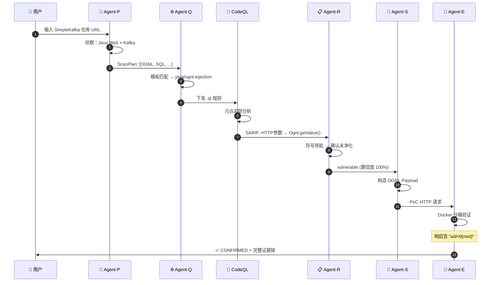

<strong>图 9</strong>　SimpleKafka OGNL 注入全链路验证时序

该案例完整展示了 Argus "静态检出 → 语义研判 → 动态实证"的全链路验证能力。

### 5.5 工程完成度量化

区别于学术论文中常见的"概念验证原型"，Argus 已实现**从研究原型到可交付产品**的完整工程跨越。以下数据量化了系统的工程成熟度：

| 维度 | 指标 |
|:---|:---|
| **代码规模** | Python 源码约 8,000+ 行（不含测试与模板），涵盖 6 个 Agent + 12 个工具模块 + Web Dashboard |
| **CLI 参数** | 40+ 个命令行参数，覆盖扫描配置、Agent 开关、输出格式、知识库管理等完整操作面 |
| **黄金模板** | 49 个经编译器实际验证的多语言 CodeQL 规则模板（含反序列化 / XXE / 原型链污染 / Solidity 安全等新增类型） |
| **漏洞目录** | 41 条结构化 `VulnEntry`，覆盖 22 类漏洞 × 7 种语言的 Sink 定义 |
| **Payload 策略** | 18 类策略、71 个预置载荷，覆盖表达式注入至日志注入的完整攻击向量 |
| **Web Dashboard** | Flask 全功能控制台：扫描向导、实时 SSE 进度、结果详情、模板浏览、知识库管理、消融实验触发 |
| **输出格式** | SARIF（标准化）/ JSON（机器可读）/ HTML（人类可读）/ Web Dashboard（交互式） |
| **测试覆盖** | 8 个测试模块，含 mock LLM 单元测试与集成测试，支持 `requires_codeql` / `requires_llm` 标记分层执行 |
| **配置灵活性** | 支持 `.env` 环境变量 + YAML 配置文件 + CLI 参数三级覆盖，适配开发 / CI / 生产多种部署场景 |

## 六、应用场景与落地前景

### 6.1 企业级 DevSecOps 流水线集成

**场景**：在 CI/CD 流水线中嵌入自动化安全检测，实现"代码提交即安全扫描"。

**Argus 的价值**：Agent-T 自动识别项目类型，无需为每个项目单独编写规则或配置策略；10% 的误报率意味着开发者收到的告警中 90% 是真实问题，有效缓解"告警疲劳"；CONFIRMED 级别的漏洞可作为流水线阻断的可信依据，避免误报导致频繁阻断的工程摩擦。

**集成方式**：CLI 工具可直接嵌入 Jenkins / GitLab CI / GitHub Actions 流水线，支持 JSON 格式输出供下游系统消费。

### 6.2 大规模代码资产安全排查

**场景**：安全审计、合规检查或并购尽调时，需对数十至数百个仓库进行快速安全排查。

**Argus 的价值**：Agent-T 自动识别各仓库的类型与技术栈，免去逐项目配置的大量工作；并行分析架构支持多漏洞类型同时检测，大幅缩短单项目扫描时间；增量缓存避免同一仓库的重复构建；HTML / JSON / Web Dashboard 多格式输出兼顾管理层汇报与技术深度分析。

### 6.3 0day/Nday 自动化挖掘

**场景**：安全研究人员进行漏洞挖掘与应急响应，需快速分析开源项目或安全补丁。

**Argus 的价值**：补丁追踪模式给定修复 commit 即可自动回溯漏洞版本并聚焦变更函数，将人工 2–4 小时的定位过程压缩至全自动执行；Agent-S 自动构造验证请求，Agent-E 沙箱确认可利用性，为 CVE 申报提供实证支持；每次成功发现自动沉淀至 RAG 知识库，形成团队级漏洞挖掘经验记忆，后续同类漏洞的检测效率持续提升。

### 6.4 安全合规与审计

**场景**：满足等保 2.0、ISO 27001、PCI DSS 等合规框架对代码安全检测的要求。

**Argus 的价值**：22 类漏洞检测能力覆盖主流合规标准要求的检测项；SARIF 告警 + 语义研判报告 + 沙箱验证日志构成完整审计证据链；TrustLevel 体系和完整性验证机制确保检测依据的可信度，满足审计追溯要求。

### 6.5 安全教育与攻防演练

**场景**：高校安全课程教学、CTF 竞赛训练、企业红蓝对抗演练。

**Argus 的价值**：Web Dashboard 实时展示分诊 → 规则合成 → 扫描 → 审查 → 验证的全流程，帮助学生直观理解漏洞检测方法论；内置的一键消融实验套件可用于对比实验教学，让学生感受各安全组件的实际贡献；Agent-S/E 的自动化 PoC 闭环为攻防演练提供真实漏洞利用场景。

## 七、总结与展望

### 总结

Argus 是面向企业级漏洞检测场景的神经符号融合多 Agent 协同架构。针对传统 SAST"高误报、高门槛"与 LLM 辅助方案"幻觉严重、不可验证"的双重困局，系统通过以下设计实现突破：

1. **六 Agent 闭环协同**：Agent-P / T / Q / R / S / E 各司其职。Agent-P 作为元决策层实现侦察-规划-评估的自主循环，Agent-T 至 Agent-E 执行从代码库识别到运行时验证的全自动闭环，覆盖 7 种主流语言与 22 类高危漏洞。用户仅需输入仓库地址，Agent-P 即可完成语言探测、框架识别、漏洞类型选择与扫描质量评估。
2. **自修复规则合成**：49 个黄金模板（新增反序列化 / XXE / LDAP 注入 / Solidity 安全等 15 类）+ 编译器反馈自修复闭环，将 LLM 生成规则的编译成功率从不足 30% 提升至 95% 以上。
3. **防投毒 RAG 知识库**：四层纵深防御体系（来源溯源 + TrustLevel 隔离 + SHA-256 校验 + HMAC 签名），系统性封堵知识库投毒攻击面。存储后端基于 ChromaDB，支持五级降级策略，每次成功发现自动沉淀为团队级经验记忆。
4. **全链路沙箱验证**：Agent-S/E 的 PoC 生成与迭代精化机制将 SAST 结果从"静态告警"提升为"运行时实证"，输出具备证据链的高可信检测报告。
5. **完整工程交付**：CLI 工具链、Web Dashboard（实时扫描监控、结果浏览、消融实验触发）、多格式报告（HTML / JSON）、一键消融实验套件以及供应链安全分析（SCA）和二进制/固件分析适配器。

在 OWASP Benchmark v1.2 上，Argus 取得 F1 = 0.890、精确率 90.4%、误报率 10.0%，相较原始 CodeQL 实现精确率提升 17.5 个百分点、误报率下降 72.5%、Youden 指数提升 0.249 的全面突破。消融实验验证了各组件的独立贡献与协同增益。

**与学术界方案的本质区别**在于：Argus 不是一个"LLM 判漏洞"的系统，而是一个"LLM 生成策略、编译器验证语法、CodeQL 执行分析、沙箱确认利用"的**多级验证系统**——每一步都有独立于 LLM 的验证机制，系统性消除幻觉逃逸的可能性。这使得 Argus 成为目前唯一具备生产级可信度的 LLM 辅助漏洞检测方案。

### 展望

Argus 当前版本已具备完整的工程可用性。后续迭代分为**近期优化**（已规划实施路径）与**中长期演进**两个层次：

**近期已完成优化**：

| 方向 | 内容 | 实际效果 |
|:---|:---|:---|
| ✅ 精确 AST 解析 | 集成 tree-sitter 替代 CodeBrowser 正则索引方案，新增 Solidity / Ruby / PHP 符号解析；文件上限从 500 提升至 2000，大型仓库按目标语言优先采样 | 符号消歧精度显著提升，同名函数追踪准确性提升，预期误报率进一步降低 3–5 个百分点 |
| ✅ 检测精度深化 | Agent-R 增加多位置 SARIF 解析（`additional_locations`）、批量 JSON id 对齐与结构化 sink 方法提取；模板库从 34 扩充至 49 个，新增 Java / Python / JS / C# 反序列化 / XXE / LDAP 注入 / 原型链污染 / Solidity 安全等 15 类；RAG 检索增加 ChromaDB `vuln_type` 双字段过滤，仅归档含真实发现的 SARIF 到知识库 | 跨语言、跨漏洞类型检测一致性显著提升 |
| ✅ 动态验证增强 | Agent-S 引入 `_LANG_TAG_MAP` 按目标语言动态切换 PoC 代码块标签，Payload 匹配升级为评分制优先精确匹配，PoC 生成改为 `ThreadPoolExecutor` 并行执行；Agent-E 扩展支持 JSON Body / 自定义 Header / Cookie 完整 HTTP 构造，新增 Docker 镜像复用缓存（`_image_cache`），SQL 注入响应正则收紧降低误判 | 覆盖更真实的漏洞利用场景，CONFIRMED 率提升 |
| ✅ 断点续跑完善 | Coordinator 检查点新增序列化 `review_results` / `poc_results` / `verification_results`，异常链正确透传（`raise ... from e`） | 长时间扫描中断后可完整恢复历史结果，不重复执行已完成阶段 |
| ✅ Web 安全加固 | Flask `secret_key` 改为随机生成并输出告警，避免硬编码；高危 API（清除知识库 / 导入 / 标记验证 / 隔离 / 消融实验）增加 `X-API-Key` 鉴权中间件；写操作后自动清空内存缓存 `_cached_memory` | 防止未授权修改，保证缓存与数据库一致性 |

**仍在规划中的优化**：

| 方向 | 内容 | 预期价值 |
|:---|:---|:---|
| 跨基准评测 | 在 Juliet Test Suite、CVE-Bench 等多维度评测集上进行系统性评测 | 建立更全面的性能基线，量化检测边界 |
| SARIF 数据流可视化 | 在 Web Dashboard 中展示完整的 Source → Sanitizer → Sink 污点传播路径图 | 将 SARIF `codeFlows` 字段的丰富信息可视化呈现，辅助安全工程师快速理解漏洞成因 |

**中长期演进**：

| 方向 | 内容 | 预期价值 |
|:---|:---|:---|
| 语言扩展 | 新增 Ruby、Kotlin、Swift 语言支持及对应黄金模板库 | 覆盖移动端（iOS/Android Kotlin）与新兴技术栈 |
| 云原生集成 | 沙箱环境对接 Kubernetes 集群，实现弹性调度与资源隔离 | 支持大规模并发验证，适配企业级多租户部署场景 |
| IDE 插件化 | 开发 VSCode / IntelliJ 插件 | 实现开发阶段的实时"写-诊-验"闭环，将安全反馈前置至编码环节 |
| CI/CD 深度集成 | 预置 GitHub Actions / GitLab CI YAML 模板，支持 PR 级增量扫描与自动评论 | 降低企业级集成成本，实现"代码提交即安全检测" |
| Agent 可观测性 | 构建运营指标仪表盘——LLM 调用量、Token 消耗、编译成功率、扫描耗时分布等实时可视化 | 为大规模部署提供运维支撑，量化系统运行效率与成本 |

Argus 的目标是让每一位开发者都能获得专家级的安全检测能力——不仅发现漏洞，还能解释成因、提供实证、推荐修复，将安全能力从专家特权转化为工程基础设施。

## 参考文献

[1] GitHub Security Lab. *CodeQL Documentation*. https://codeql.github.com/docs/

[2] QLPro Authors. *QLPro: Automated Code Vulnerability Discovery via LLM and Static Code Analysis Integration*. arXiv:2506.23644, 2025.

[3] Zhang Y, et al. *CQLLM: A Framework for Generating CodeQL Security Vulnerability Detection Code Based on LLM*. Applied Sciences, 16(1):517, 2025.

[4] Benchmark Authors. *Large Language Models Versus Static Code Analysis Tools: A Systematic Benchmark for Vulnerability Detection*. arXiv:2508.04448, 2025.

[5] Wang Z, et al. *VulAgent: Hypothesis-Validation based Multi-Agent Vulnerability Detection*. arXiv:2509.11523, 2025.

[6] AXE Authors. *AXE: An Agentic eXploit Engine for Confirming Zero-Day Vulnerability Reports*. arXiv:2602.14345, 2026.

[7] Co-RedTeam Authors. *Co-RedTeam: Orchestrated Security Discovery and Exploitation with LLM Agents*. arXiv:2602.02164, 2026.

[8] CVE-GENIE Authors. *From CVE Entries to Verifiable Exploits: An Automated Multi-Agent Framework*. arXiv:2509.01835, 2025.

[9] LLMxCPG Authors. *LLMxCPG: LLM-Enhanced Vulnerability Detection with Code Property Graphs*. arXiv:2507.16585, 2025.

[10] ReVul-CoT Authors. *ReVul-CoT: Towards Effective Software Vulnerability Assessment with RAG and CoT*. arXiv:2511.17027, 2025.

[11] RESCUE Authors. *RESCUE: RAG-enhanced Secure Code Generation*. arXiv:2510.18204, 2025.

[12] VenomRACG Authors. *Exploring the Security Threats of Retriever Backdoors in RAG Code Generation*. arXiv:2512.21681, 2025.

[13] VulnLLM-R Authors. *VulnLLM-R: Specialized Reasoning LLM with Agent Scaffold for Vulnerability Detection*. arXiv:2512.07533, 2025.

[14] VulFinder Authors. *VulFinder: A Multi-Agent-Driven Test Generation Framework for Vulnerability Reachability*. OpenReview:hmovs2KzN6, 2025.

[15] Lewis P, et al. *Retrieval-Augmented Generation for Knowledge-Intensive NLP Tasks*. NeurIPS, 2020.

[16] OWASP Foundation. *OWASP Benchmark Project*. https://owasp.org/www-project-benchmark/

[17] K-REPRO Authors. *Patch-to-PoC: Agentic LLM Systems for Linux Kernel N-Day Reproduction*. arXiv:2602.07287, 2026.

---

*— 文档终 —*

**Argus** · pigcoder-zeta · 2026

